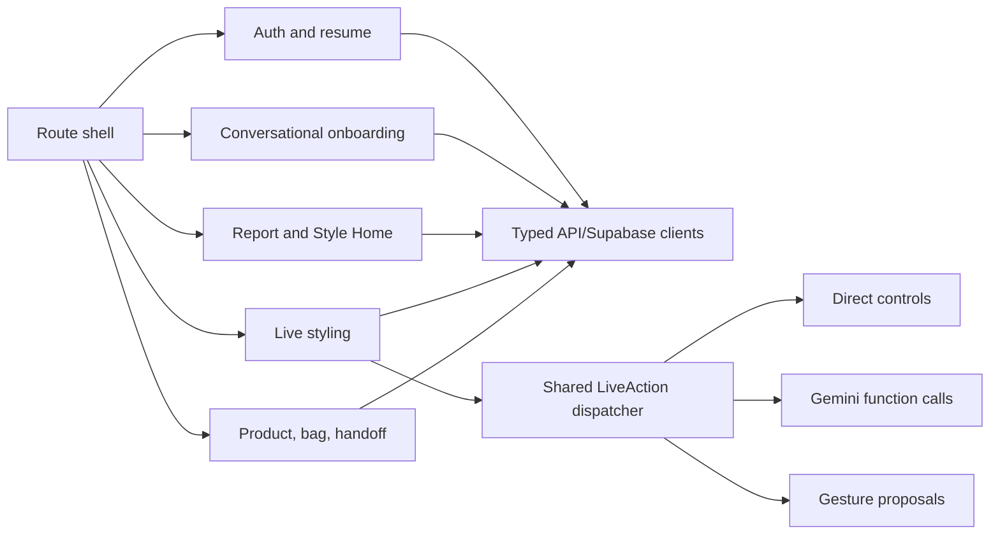
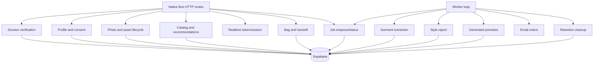

# Component Architecture

## Frontend boundaries



### `apps/web` planned modules

| Module | Responsibility | State authority |
|---|---|---|
| `app/router` | Public/protected routes, auth callback, resume routing, not-found | Route + authenticated account summary |
| `features/auth` | Anonymous start, Google, magic link, callback, anonymous-draft claim | Supabase Auth + server claim result |
| `features/onboarding` | One-question-per-turn chat, profile, brand/category size, photo collection, taste calibration | Persisted profile/progress; transcript is presentation only |
| `features/media` | File preflight, upload progress, camera/mic permissions, signed asset display | Server photo/asset records |
| `features/report` | Processing/slow/error states, overview, color, body-style, recommendations, feedback | Versioned report records |
| `features/catalog` | Current product query, filters, product detail, unavailable state | Live Shopify response + stored stable references |
| `features/live` | Decart/Gemini connections, direct controls, gestures, shared action confirmation | Live session record + in-memory connection state |
| `features/bag` | Save/remove, group by retailer, refresh, handoff confirmation | Account-owned bag rows + live catalog refresh |
| `shared/accessibility` | Focus, keyboard alternatives, reduced motion, announcements | Local UI behavior |
| `shared/api` | Fetch wrapper, auth header, request ID, normalized error parsing | Server contract |
| `shared/contracts` | Re-export shared Zod schemas safe for browser use | `packages/contracts` |

The 48 approved screen/state records map into these feature modules; they do not become 48 separate applications or stores. The adopted eight-state conversational package owns pre-report presentation while writing the same validated profile contract.

## Backend boundaries



### `apps/api` planned capabilities

| Capability | Responsibility | External boundary |
|---|---|---|
| `auth` | Verify bearer session; issue/claim one-time anonymous transfer; account summary | Supabase Auth/Postgres |
| `profile` | Validate/save answers, brands/sizes, progress, consent versions | Supabase Postgres |
| `photos` | Complete uploads, validate ownership/type/quality state, signed reads/deletes | Supabase Storage/Postgres |
| `extraction` | Enqueue and normalize per-photo garment extraction; preserve partial success | OpenAI + Storage |
| `taste` | Generate balanced candidate descriptors; record Love/Hate/Maybe/undo | Postgres; optional OpenAI/catalog inputs |
| `reports` | Enqueue/status/read/recalibrate versioned report | OpenAI + Postgres |
| `catalog` | Live UCP search/get-product, normalize stable references, refresh current facts | Shopify Global Catalog |
| `previews` | Generate and quality-gate derived likeness previews | OpenAI image generation |
| `live` | Create owned live session; mint Decart/Gemini short-lived credentials | Decart/Gemini |
| `bag` | Save stable references, remove, refresh, handoff event | Postgres + Shopify |
| `jobs` | Enqueue, idempotency, lease, retry, terminal outcome | Postgres |
| `retention` | Delete expired records/assets by approved asset class | Supabase Postgres/Storage |
| `notifications` | Report-ready email with no sensitive report content | Resend |

Each route handler directly composes Zod parsing, one capability function, and Supabase/provider calls. Create a helper only after two real call sites, except typed provider/error/auth boundaries, which are justified at one call site.

## Dependency direction

```text
route or worker entrypoint
  -> shared contract parsing
  -> feature capability
  -> Supabase or one typed provider adapter
```

Allowed dependencies point inward toward contracts and pure domain rules. Provider adapters cannot import frontend modules. Feature capabilities cannot call another feature's HTTP endpoint; shared behavior is a direct function or database contract.

## Prohibited coupling

- Browser code never imports server credentials or provider admin clients.
- Model transcripts never determine profile completion, authorization, product identity, or job status.
- Product records never embed Shopify search responses or copied product images.
- Database rows never contain photo/image bytes.
- Voice, gesture, and buttons never call Decart independently; all dispatch the same validated `LiveAction`.
- Report generation never blocks account/auth routes.
- Realtime failure never deletes report, selection, or bag state.
- A provider-specific response shape never crosses the API boundary before normalization.

## Wardrobe reuse decision

`tandpfun/wardrobe` is a current MIT-licensed JavaScript/Vite reference that uses OpenAI Responses for garment detection and the Images API for clean cutouts. Magic Mirror will inspect and port only the smallest proven detection/cutout/deduplication logic into typed worker modules, preserve required notices, and replace local `data/` persistence with owned Supabase records and private assets. It will not embed the reference application's shell, JSON database, model-reference requirement, or modeled-lookbook workflow.

Source: [tandpfun/wardrobe](https://github.com/tandpfun/wardrobe).

## Shared live-action boundary

The later application-contract step will finalize the union, but architecture fixes its shape:

```text
LiveAction =
  next_item | previous_item | select_item | refine_catalog |
  change_variant | add_to_bag | open_retailer | end_session
```

Every proposal carries `source` (`direct`, `voice`, or `gesture`), `sessionId`, a monotonically increasing client sequence, and parameters. Consequential actions (`add_to_bag`, `open_retailer`, `end_session`) require explicit confirmation. Duplicate or stale sequences do not execute twice.

## Route families

| Route family | Screen/state coverage |
|---|---|
| `/`, `/auth`, `/auth/callback` | landing, account access, magic-link sent, auth recovery |
| `/style-report/start/*` | conversational personal details, brand sizing, photos, photo review, taste, account, profile review |
| `/analysis` | processing, slow, error/retry |
| `/report/*` | overview, color, body-style, recommendations, feedback |
| `/style` | Style Home base/resume, suggested outfits, live entry |
| `/live/:sessionId` | permissions, connecting, ready, slow, changing, voice, gesture, error, ended |
| `/bag` | bag base and unavailable-item state |

Product detail is a URL-addressable drawer state so browser back/forward and shared links preserve context. Retailer handoff is a confirmation state before opening an external destination.
