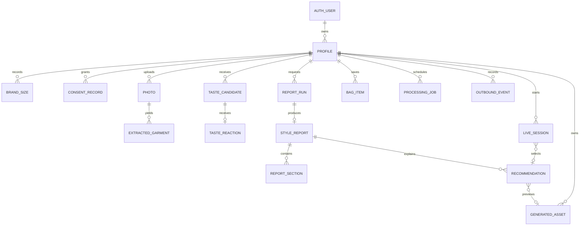
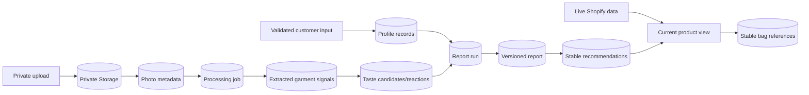

# Data Architecture

This file defines architecture-level entities and ownership. The later `data-contract` step owns exact migration SQL, exhaustive field constraints, enum definitions, and compatibility review.

## Entity relationship diagram



`AUTH_USER` is `auth.users`. Every customer-owned public row contains an immutable `owner_id` referencing that identity and is protected by RLS. Anonymous Supabase users use the same ownership model as permanent users.

## Core records

| Record | Required architecture fields | Ownership and constraints |
|---|---|---|
| `profiles` | `id`, `owner_id`, `status`, name, adult confirmation, gender, age, height, optional weight, onboarding step, created/updated | One active profile plus preserved drafts per owner; sensitive fields never enter logs |
| `brand_sizes` | `id`, `profile_id`, brand, category, size label | Unique profile + normalized brand + category; customer-entered label preserved |
| `consent_records` | `id`, `profile_id`, purpose, version, granted/revoked time | Append-only evidence per purpose; revocation drives feature disable/delete behavior |
| `photos` | `id`, `profile_id`, storage path, status, media type, dimensions, byte size, rejection code, timestamps | Private path under owner/profile; 8 valid minimum and 12 maximum enforced at completion boundary |
| `extracted_garments` | `id`, `profile_id`, source photo, derived asset, category/color/material/pattern/fit signals, confidence, duplicate group, status | Extract styling-visible garments only; correction/delete independent per item |
| `taste_candidates` | `id`, `profile_id`, source type/reference, bounded attributes, position, status | Balanced dynamic or curated fallback set; no Shopify image caching |
| `taste_reactions` | `candidate_id`, `profile_id`, reaction, created time, undone time | One active Love/Hate/Maybe reaction per candidate; undo is explicit state, not deletion |
| `report_runs` | `id`, `profile_id`, status, stage, attempt, started/completed/failed times, normalized error | Idempotent per submitted profile revision; owns 120-second lifecycle |
| `style_reports` | `id`, `profile_id`, `report_run_id`, version, summary, confidence/disclosure metadata, created time | Immutable completed version; corrections produce new version or feedback, not silent mutation |
| `report_sections` | `id`, `report_id`, section type, ordered bounded structured content | Exact Zod schema per section; no unbounded transcript or arbitrary provider blob |
| `recommendations` | `id`, `report_id`, stable Shopify refs, normalized style rationale, optional generated asset | Store references/rationale only; refresh product facts live before display/action |
| `generated_assets` | `id`, `profile_id`, kind, source lineage, private storage path, status, expires time | Distinguish original, cutout, reconstruction, and likeness preview; never overwrite source |
| `live_sessions` | `id`, `profile_id`, selected recommendation/ref, status, consent flags, provider session references, latency summaries | No camera/video bytes by default; provider references are non-secret and short-lived |
| `bag_items` | `id`, `profile_id`, stable Shopify product/variant/shop refs, source recommendation/live session, saved time | Unique active stable item reference per profile; refresh current facts on every display/handoff |
| `processing_jobs` | `id`, `profile_id`, kind, subject id, status, idempotency key, attempt, available/lease times, normalized error | Server/worker only; bounded payload references records instead of embedding photos/provider bodies |
| `outbound_events` | `id`, `profile_id`, stable retailer/product refs, occurred time | No email, profile traits, report text, or image URLs |

## Authoritative data movement



Customer inputs and application writes are authoritative. Provider output is evidence to validate and normalize, never a database write contract by itself. Shopify remains authoritative for live product facts.

## Storage layout

Use separate private buckets to make retention and policy visible:

```text
customer-photos/{owner_id}/{profile_id}/{photo_id}/original
derived-assets/{owner_id}/{profile_id}/{asset_id}/{kind}
generated-previews/{owner_id}/{profile_id}/{asset_id}/preview
```

Objects are accessed through user-scoped Supabase policies or short-lived signed URLs created after ownership checks. Storage paths are opaque references in Postgres. Never place an email address, name, or catalog title in a path.

## Known query patterns and indexes

Only indexes tied to a real path are planned:

- unique active profile/draft key by `owner_id` and profile status;
- profile progress and latest report by `owner_id` / `profile_id` + descending creation time;
- photos and extracted garments by `profile_id` + status;
- active reactions by `profile_id` and candidate;
- job claim by status + `available_at`, plus unique idempotency key;
- bag items by profile + saved time, with unique active stable variant/shop reference;
- expired assets/profiles by `expires_at` for retention cleanup.

No generalized full-text, vector, or analytics index is added initially. Shopify performs catalog search; Postgres stores structured customer state.

## Validation boundaries

- Browser preflight improves feedback but is not trusted.
- API Zod schemas validate every request and normalized provider response.
- Database constraints enforce ownership references, valid state transitions, counts/uniqueness where possible, and non-null invariants.
- Storage completion validates actual media signature, size, dimensions, and ownership rather than trusting filename or browser MIME.
- Report and extraction provider outputs must parse fully; partial invalid output is a normalized failure or explicitly preserved per-item partial result.

## Retention and deletion

| Asset/state | Rule |
|---|---|
| Anonymous incomplete profile and owned assets | Delete after 7 days of inactivity |
| Original photos | Delete 30 days after report generation, or sooner on customer deletion |
| Derived crops/cutouts | Same or shorter lifetime than source; cascade when source/account deleted |
| Generated likeness previews | Delete after 30 days or sooner on customer deletion; keep text recommendation and stable product ref |
| Structured profile, reactions, reports, bag | Retain until customer deletion or explicit profile reset |
| Live camera/video | Never persist by default |
| Voice transcript | Never persist by default; retain only redacted operational events |

Deletion is a job with explicit progress and retry, not a soft-delete fiction. Account deletion revokes active sessions, marks owned data unavailable immediately, deletes private objects and rows, and records only a non-sensitive completion/failure event. Provider and backup residual windows are documented separately.

## Migration strategy

- Create migrations with the Supabase CLI and commit them under `supabase/migrations/`.
- Start with the smallest tables needed by the first integrated slice, then add report/catalog/live extension tables with their feature tickets.
- Every exposed table receives RLS before application access.
- Prefer backward-compatible expand/migrate/contract changes; do not edit applied migrations.
- Generate TypeScript database types after migrations and validate them against Zod boundary schemas.
- One narrowly scoped private job-claim function may use elevated rights; it remains outside exposed schemas, revokes `PUBLIC` execute, and is callable only by the server credential.
