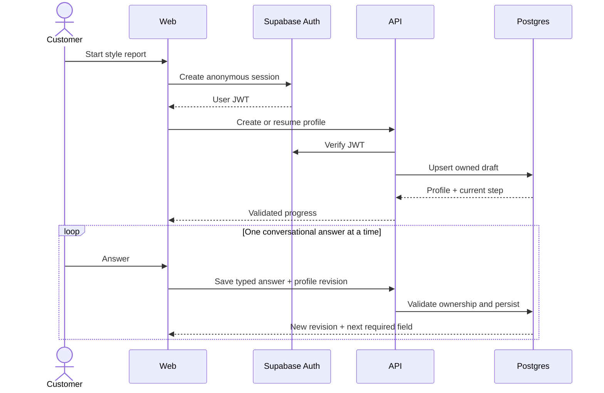
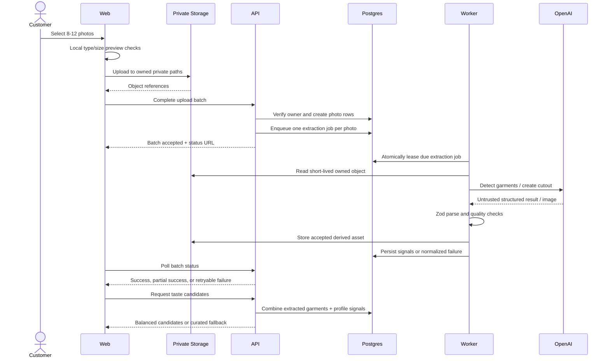
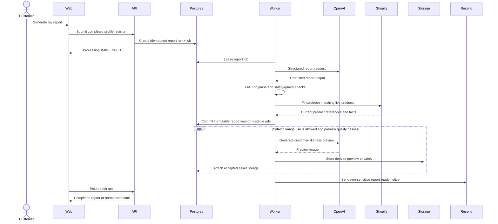
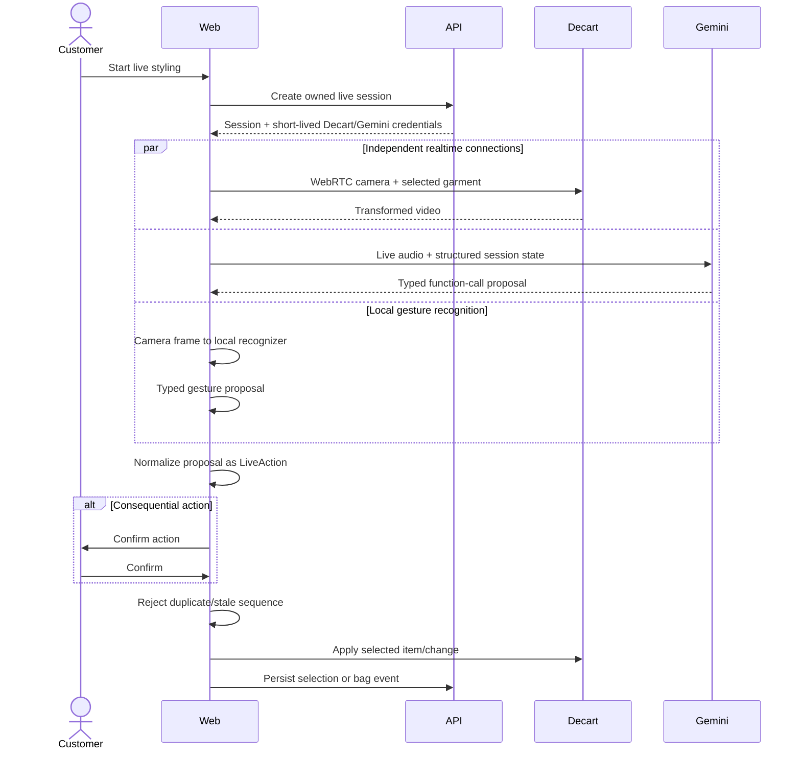
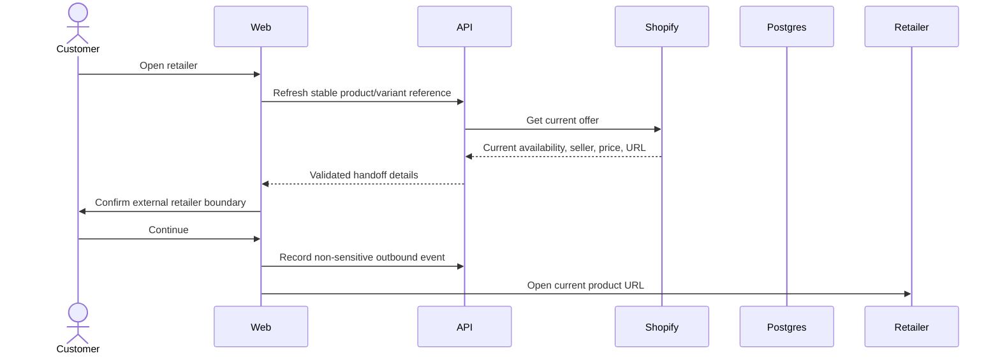
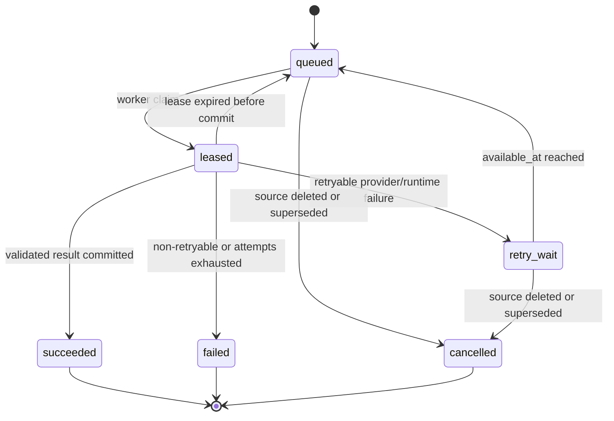

# Critical Runtime Flows

The diagrams below fix system responsibilities and recovery behavior. Exact HTTP payloads, database enums, and timeout constants belong to later contract steps.

## Anonymous start and profile persistence



The visual transcript is not durable authority. Each accepted answer writes the same profile contract used by the archived form presentation. A lost browser can resume from persisted progress after session recovery.

## Photo upload, garment extraction, and taste calibration



Each photo fails independently. Partial extraction never discards successful photos and never blocks the report when the minimum direct photo/style signals remain usable. The customer sees failed photos and may retry or continue with an explicit lower-confidence disclosure. If the Wardrobe-inspired spike fails its quality/latency bar, the worker records coarse direct style signals and taste calibration uses the balanced curated fallback.

## Anonymous-to-permanent account connection

```mermaid
sequenceDiagram
  actor Customer
  participant Web
  participant API
  participant Auth as Supabase Auth
  participant DB as Postgres

  Web->>API: Prepare account transfer
  API->>DB: Store hashed one-use transfer token, owner, expiry, profile revision
  API-->>Web: Opaque transfer token
  alt Google or magic link creates/links the same anonymous identity
    Web->>Auth: Connect identity
    Auth-->>Web: Permanent session
    Web->>API: Finalize transfer
    API->>DB: Verify token + ownership; mark connected
  else Email already belongs to another account
    Web->>Auth: Authenticate existing account
    Auth-->>Web: Existing-account session
    Web->>API: Claim anonymous draft with token
    API->>DB: Transactionally copy/merge draft into existing owner
  end
  DB-->>API: Claimed profile + conflicts
  API-->>Web: Resume latest safe step
```

The opaque token is short-lived, single-use, stored only as a hash, and bound to the anonymous owner and profile revision. An existing permanent profile is never silently overwritten. Conflicting drafts remain explicit and the source anonymous draft becomes inaccessible after a successful transaction.

## Durable report generation and previews



Submitting the same profile revision returns the same active or completed run. The browser shows normal processing, slow, retryable failure, and terminal failure states; it does not hold the request open for two minutes. Preview failure degrades to text plus live product cards. Invalid report output does not partially publish. Retries reuse the idempotency key and never duplicate a completed report or email event.

## Live try-on, voice, and gesture



Direct buttons, Gemini function calls, and recognized gestures share one dispatcher. Gesture detection proposes rather than directly executes actions. Decart and Gemini reconnect independently; loss of either leaves direct controls and persisted selections available. The dual-realtime spike determines whether structured state is sufficient for Gemini or whether consented video/screen frames materially improve the experience within device, bandwidth, echo, and latency limits.

## Retailer handoff



If refresh fails or the offer is unavailable, Magic Mirror does not open a stale link silently; it offers another recommendation or a retry. Checkout remains entirely with the retailer.

## Durable processing state



Workers heartbeat long tasks and commit the output and terminal job state transactionally when practical. A stale lease is recoverable; the user-visible subject record remains the source for current status.
