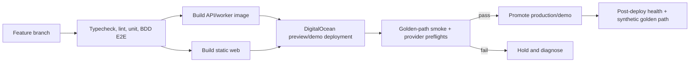
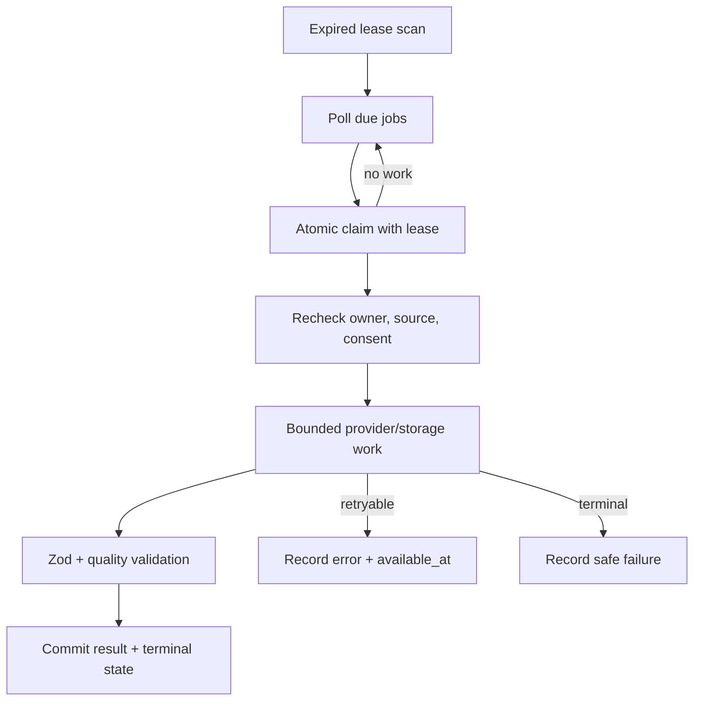

# Operations and Deployment Architecture

## DigitalOcean deployment shape

One DigitalOcean App Platform application contains three independently deployable components:

| Component | Source / command | Responsibility | Scale at start |
|---|---|---|---|
| `web` static site | Build `apps/web`; publish `dist/` | Vite application and static assets | CDN-managed |
| `api` web service | Shared Bun container; run server entrypoint | Authenticated JSON routes, catalog refresh, realtime-token minting | One instance |
| `worker` worker | Same Bun container; run worker entrypoint | Extraction, reports, previews, email, retention | One instance |

The API and worker share a container only to reuse the Bun runtime and application code; they run separate processes and scale independently. A checked-in App Platform specification will define component roots, commands, health checks, and environment-variable references without secret values.

Use deployment jobs only for bounded migration/release actions. Do not use App Platform jobs as the durable application queue; `processing_jobs` in Postgres owns that lifecycle.

## Build and release flow



Database migration runs before application promotion only when the migration is backward-compatible with the currently running release. Destructive contract changes require a later cleanup release after all readers have moved.

## Health checks

- `GET /healthz`: process event loop is responsive; no provider or database call.
- `GET /readyz`: API can perform one bounded Supabase connectivity check and required configuration names are present; it does not call paid or realtime providers.
- Worker heartbeat: update a non-sensitive operational heartbeat/lease timestamp and expose backlog age/count through a server-only metric query.
- Synthetic golden path: use a synthetic or founder-consented fixture and one permitted garment; never a production customer's photo.

A provider outage does not fail `/readyz` and trigger a restart loop. Provider status appears in feature-specific preflights and user-visible failure states.

## Timeouts, retries, and idempotency

Every outbound call has an abort signal and normalized error. Initial bounded defaults are architecture guidance; the contracts and spikes may tighten them with evidence.

| Operation | Initial bound | Retry policy | Idempotency / fallback |
|---|---:|---|---|
| Ordinary API/provider lookup | 8-15 seconds | At most one jittered retry for safe transient failures | Request ID; visible retry |
| Auth/realtime token mint | 10 seconds | One safe retry; never reuse expired token | Owned live-session ID |
| Report attempt | Worker deadline below the 120-second product target | Maximum two total attempts for retryable failures | Profile-revision idempotency key; preserve inputs |
| Generated preview | 90-second worker attempt | Maximum two total attempts if provider marks retryable | Recommendation/source lineage; text-only fallback |
| Extraction per photo | Spike-calibrated bounded attempt | Per-photo maximum two attempts | Photo revision; partial-batch success |
| Shopify refresh | 8 seconds | One jittered retry | Stable product/variant/shop reference; unavailable state |
| Email notice | 10 seconds | Durable retry with one send-event key | Report ready without email remains accessible |

Rate-limit and cost failures are not tight-loop retries. Workers set `available_at`, release the lease, and use bounded backoff. Non-retryable validation, permission, and content-safety failures enter an explicit terminal state.

## Worker reliability



Long work heartbeats its lease. A worker crash leaves a lease that another worker can reclaim. Result persistence checks the same idempotency key before writing so replay cannot duplicate reports, previews, or emails. Queue payloads contain references, not image bytes or provider bodies.

Start with one worker. Add a second only when measured backlog age threatens the two-minute report target or blocks demo throughput; the atomic claim boundary already supports it. Do not add Redis, a broker, or orchestration platform without measured need.

## Observability

Structured JSON logs include:

- timestamp, environment, component, release, request/job ID;
- authenticated owner only as a one-way operational pseudonym when correlation is necessary;
- route/capability, status, duration, attempt, provider name, normalized error code;
- report stage, queue wait, generation latency, live action source, reconnect count, and outbound handoff outcome as bounded fields.

Logs exclude emails, names, profile attributes, prompts, model responses, transcripts, product descriptions, raw URLs, storage paths, signed URLs, tokens, and image/audio/video bytes.

Initial dashboards/queries cover API error rate and latency, job backlog age, report completion time, extraction partial-failure rate, preview acceptance/fallback rate, provider failure code, live connection/reconnect latency, gesture false-action/confirmation rate during the spike, and retention failures. These are measurements, not invented production SLOs.

Each client error uses the normalized shape:

```json
{
  "error": "Customer-safe summary",
  "code": "STABLE_MACHINE_CODE",
  "details": {},
  "requestId": "opaque-id"
}
```

`details` is allowlisted and never contains provider bodies or sensitive values.

## Degraded modes and runbook decisions

| Failure | Customer-visible behavior | Operator action |
|---|---|---|
| OpenAI quota or outage | Preserve inputs; report/extraction shows retryable failure; previews fall back to text/product cards | Reverify paid request, billing, model access before dependent ticket/demo |
| Shopify unavailable | Preserve stable refs; mark live facts unavailable; do not hand off stale offer | Retry bounded refresh and use permitted demo fixture for narrow golden path |
| Decart unavailable | Keep report/product selection and static preview; show live-session retry/fallback | Check access, region/device metrics, provider status |
| Gemini unavailable | Keep direct/gesture controls and Decart session; voice reconnects independently | Re-mint session after bounded backoff; never expose permanent key |
| Gesture confidence low | Do not execute; surface direct/voice alternatives | Disable gesture proposal path for device/session |
| Worker stalled | Existing data remains readable; processing shows slow state | Inspect lease/backlog, restart worker, reclaim expired leases |
| Resend unavailable | Auth/report remain available where session permits; report email queues retry | Check SMTP/API state without printing credentials |
| Supabase unavailable | Stop mutations and asset signing; show recoverable service state | Avoid provider work without persistence; recover connectivity first |

OpenAI's current paid execution was verified to fail with `insufficient_quota`. The founder authorized planning under an assumption that credits will be added. Every OpenAI-dependent implementation ticket must begin with a successful minimal paid call and cannot be marked complete without it.

## Backup, restore, and rollback

- Use Supabase managed backups appropriate to the project plan; document actual point-in-time/retention capability before claiming it.
- Keep migrations and synthetic seed data in Git; private customer/test media never enters Git or seed fixtures.
- Before schema work, verify a restore path for the actual Supabase plan. Backups do not replace customer-asset retention/deletion jobs.
- Roll back application code to the previous DigitalOcean deployment while leaving backward-compatible schema expansions in place.
- Never roll back by deleting unknown rows or storage prefixes. Repair with explicit, owner-scoped migrations/jobs.
- Reconcile storage metadata to objects after partial deletion or worker incidents.

## Deployment completion checklist

Before the production/demo origin is considered ready:

1. Set DigitalOcean encrypted variables and verify no secret entered the web build.
2. Add the exact final origin/callback to Supabase Auth and Google OAuth; remove obsolete preview origins.
3. Apply migrations and verify RLS with two-user negative tests.
4. Run OpenAI, Shopify, Decart, Gemini, Supabase Storage, and Resend preflights using non-sensitive fixtures.
5. Pass the observable one-photo/one-garment golden-path Playwright scenario.
6. Exercise one report job, slow/failure UI, and worker restart recovery when that extension is integrated.
7. Confirm photo, derived-asset, and generated-preview deletion paths.
8. Record the public repository, README, demo URL/video, category, project description, and Codex feedback Session ID required for the Devpost submission.
