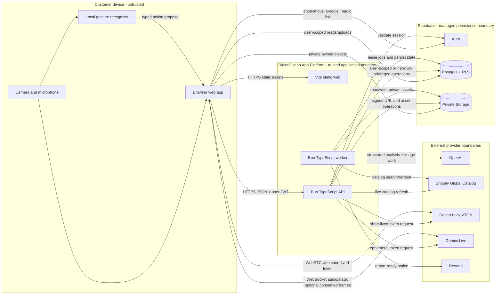
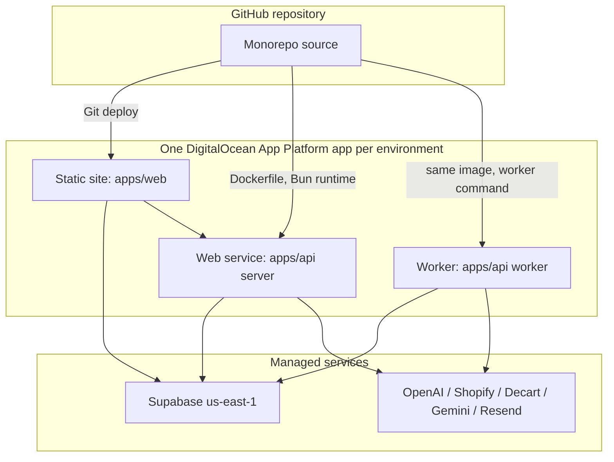

# Runtime and Deployment Topology

## System topology

The browser is untrusted. It can hold a Supabase user session and short-lived Decart/Gemini credentials, but never a permanent provider or Supabase admin credential. The API validates the Supabase session on every protected request. The worker is the only component that executes durable OpenAI/report jobs.

Material failures: if the API is unavailable, the browser preserves only transient unsent state and shows a retry; persisted onboarding remains in Supabase. If the worker restarts, leased jobs become claimable after their lease expires. If realtime providers fail, report/product state remains available and direct non-video controls remain.

## Deployment topology

Use one App Platform app per environment so each environment's static, service, and worker components share deployment history without sharing data, secrets, domains, or deployment triggers across environments. `magic-mirror-dev` is the Developer integration and QA-candidate app; `magic-mirror-prod` is the DevOps-controlled production app. The API and worker use the same environment-specific container-image digest with different commands. This preserves Bun in production even when buildpack support changes.

Official deployment references: [container images](https://docs.digitalocean.com/products/app-platform/how-to/deploy-from-container-images/), [workers](https://docs.digitalocean.com/products/app-platform/how-to/manage-workers/), and [jobs](https://docs.digitalocean.com/products/app-platform/how-to/manage-jobs/).

## Environment boundaries

| Environment | Web/API origin | Data | Secrets |
|---|---|---|---|
| Local | `http://localhost:5173` and `http://localhost:3000` | Local Supabase or the isolated development Supabase environment; synthetic or consented fixtures only | `.env.local`, ignored |
| Development/QA | `magic-mirror-dev` DigitalOcean app | Persistent isolated Supabase development branch or separate development project; no production customer data | Development-only DigitalOcean encrypted variables |
| Production/demo | `magic-mirror-prod` DigitalOcean app and approved production domain | `vhpxxmefcuewkmukissr` production Supabase project | Production-only DigitalOcean encrypted variables and Supabase provider settings |

The development and production hostnames must be added only to their matching Supabase Auth redirect allowlists and Google OAuth origins. Do not use wildcard production origins or point development/QA at the production Supabase project. Developer may mutate `magic-mirror-dev`; only the DevOps stage may mutate `magic-mirror-prod` after the QA release gate passes.

## Relationship types

- **Synchronous HTTPS:** browser/API, API/Auth, API/catalog refresh, token minting, direct profile/bag operations.
- **Asynchronous durable work:** extraction, report generation, generated previews, notification, and retention through Postgres job rows and the worker.
- **Realtime:** browser-to-Decart WebRTC and browser-to-Gemini Live WebSocket; independent reconnects.
- **Batch/cleanup:** worker scans due retention jobs; no raw-image batch export.
- **Webhooks:** none required for the first architecture. Add provider webhooks only when a real provider flow requires them.

## Configuration boundary

Browser-safe names: `VITE_SUPABASE_URL`, `VITE_SUPABASE_PUBLISHABLE_KEY`, `VITE_API_BASE_URL`.

Server-only names: `SUPABASE_SERVICE_ROLE_KEY` or current Supabase secret key, `OPENAI_API_KEY`, `GEMINI_API_KEY`, `DECART_API_KEY`, `EMAIL_DELIVERY_API_KEY`, `EMAIL_FROM_ADDRESS`, `SHOPIFY_AGENT_PROFILE_URL`, `APP_BASE_URL`, `CORS_ALLOWED_ORIGINS`.

The exact modern Supabase server credential name will be reconciled during contracts; no server key is exposed through a `VITE_` prefix.
