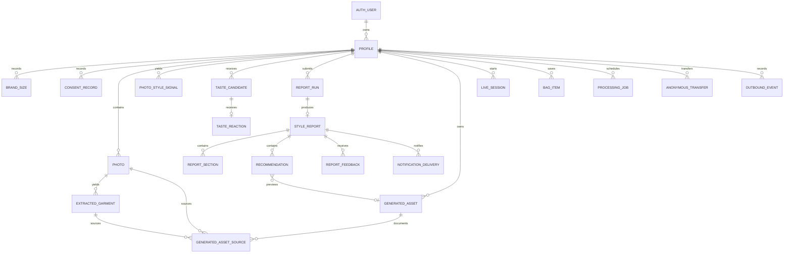
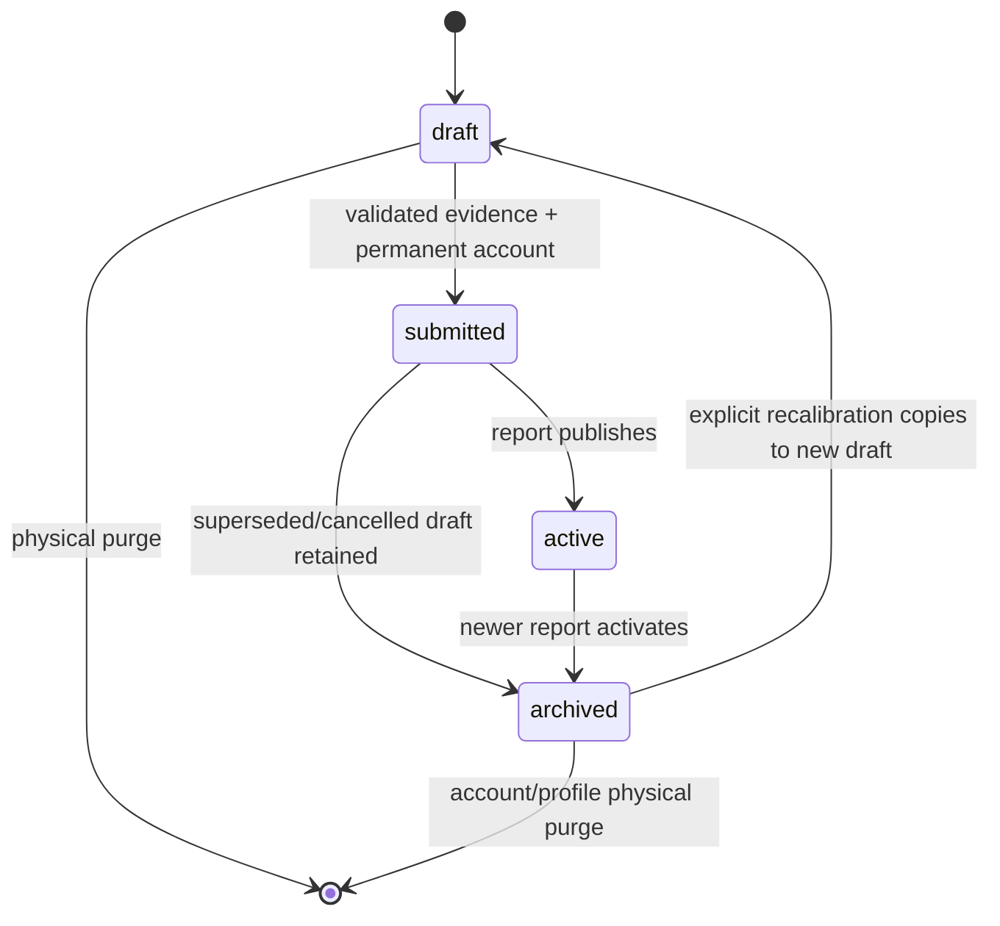
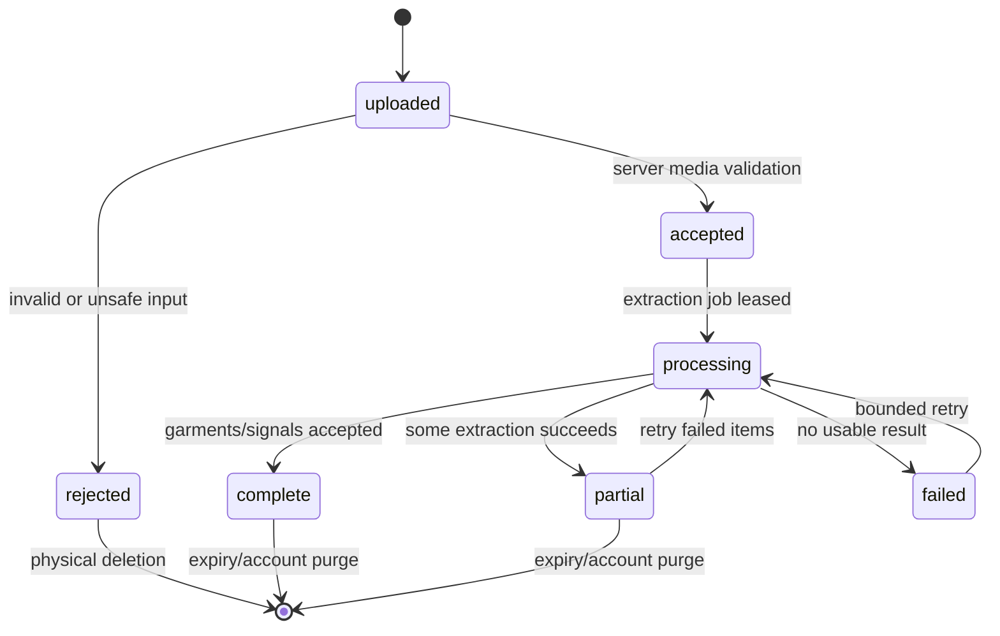

# Data Contract

- **Status:** Complete; awaiting data review
- **Date:** 2026-07-20
- **Database:** Supabase Postgres
- **Binary storage:** Supabase private Storage
- **Schema style:** lowercase `snake_case`, UTC `timestamptz`, text plus named check constraints for bounded enums

This contract is exact enough to produce migrations and shared Zod schemas. It defines persistence only; HTTP operations and screen mappings belong to the later application-contract checkpoint.

## Contract decisions

1. `auth.users.id` is identity authority. Anonymous sign-ins are real users and therefore use the `authenticated` Postgres role; `anon` receives no customer-data grants.
2. Customer-visible identifiers use `uuid default gen_random_uuid()`. Sequential identities would be denser, but opaque URL-safe IDs avoid a second public identifier and the hackathon volume does not justify a UUIDv7 extension.
3. Every customer-owned `public` row carries `owner_id uuid not null`. Child tables use composite foreign keys to `(owner_id, parent_id)` so ownership cannot diverge from the parent.
4. A submitted profile is an immutable evidence set. Corrections create a new draft with `derived_from_profile_id`; completed reports remain reproducible rather than silently changing beneath the customer.
5. Provider bodies, transcripts, prompts, copied Shopify payloads/images, and raw media bytes are never stored in Postgres. JSONB is used only for the bounded shapes specified below.
6. Media objects are immutable. Replacing a photo creates a new object/row; browser Storage upsert is not enabled.
7. Public schema exposure is explicit. Each migration grants only named operations in addition to enabling RLS; current Supabase projects do not automatically expose new tables through the Data API.
8. Worker, transfer-token, notification, and outbound-event records live in non-exposed `private`; `anon` and `authenticated` receive no schema usage.
9. No soft deletion column exists. Purge work remains a durable private job; customer access is revoked first, objects are deleted, and rows are then physically removed.

## Entity relationship diagram



`AUTH_USER` is `auth.users`. `PROCESSING_JOB`, `ANONYMOUS_TRANSFER`, `NOTIFICATION_DELIVERY`, and `OUTBOUND_EVENT` are private operational tables.

## Shared conventions

### Identifiers and timestamps

- Primary keys: `uuid primary key default gen_random_uuid()`.
- `owner_id`: `uuid references auth.users(id) on delete cascade`; never accepted from an untrusted request.
- Every public table declares `unique (owner_id, id)`. This supplies the composite parent key and an owner-leading index for RLS.
- Same-owner child keys use `(owner_id, parent_id) references parent(owner_id, id) on update cascade on delete cascade`. Owner updates occur only inside the private transfer transaction.
- Other foreign keys use `on delete cascade` only for true owned children. Stable external references use text, not foreign keys.
- `created_at`: `timestamptz not null default now()`.
- Mutable records also have `updated_at timestamptz not null default now()` maintained by one reused `private.set_updated_at()` trigger function.
- Completion/expiry/lease timestamps are nullable until their named transition occurs.
- All text is UTF-8. Use `text`; enforce product limits with checks or Zod rather than `varchar(n)`.

### Bounded text limits

| Value | Limit |
|---|---:|
| Customer name | 120 characters |
| Gender self-description | 80 characters |
| Brand/category/size labels | 80 / 80 / 40 characters |
| Short title/label | 120 characters |
| Summary/rationale/customer feedback | 2,000 characters |
| Operational error code | 80 characters |
| Catalog/shop/variant reference | 512 characters |

Whitespace-only values fail validation. Catalog references are opaque case-sensitive strings and are never normalized by lowercasing.

## Bounded enum values

These are `text` columns with named check constraints, not Postgres enum types, so additive compatibility changes do not require enum recreation.

| Domain | Allowed values |
|---|---|
| `profile_status` | `draft`, `submitted`, `active`, `archived` |
| `onboarding_step` | `welcome`, `personal_details`, `brand_sizing`, `photos`, `photo_review`, `taste`, `account`, `profile_review`, `complete` |
| `consent_purpose` | `profile_processing`, `photo_analysis`, `garment_extraction`, `generated_likeness_preview`, `account_connection`, `live_camera`, `live_microphone`, `gemini_visual_context` |
| `consent_decision` | `granted`, `revoked` |
| `photo_status` | `uploaded`, `accepted`, `rejected`, `processing`, `partial`, `complete`, `failed` |
| `asset_kind` | `garment_cutout`, `wardrobe_preview`, `tryon_still` |
| `asset_status` | `processing`, `accepted`, `rejected`, `failed` |
| `garment_source_kind` | `wardrobe_extraction`, `direct_photo_signal` |
| `garment_review_status` | `not_required`, `pending`, `confirmed`, `rejected` |
| `candidate_source` | `extracted_garment`, `shopify_catalog`, `curated_fallback` |
| `candidate_status` | `ready`, `unavailable`, `retired` |
| `taste_reaction` | `love`, `hate`, `maybe` |
| `report_run_status` | `queued`, `processing`, `succeeded`, `failed`, `cancelled` |
| `report_stage` | `queued`, `profile_analysis`, `catalog_matching`, `report_writing`, `preview_generation`, `finalizing` |
| `report_section_type` | `overview`, `color`, `body_style` |
| `feedback_kind` | `helpful`, `unclear`, `incorrect`, `recalibrate` |
| `feedback_status` | `open`, `applied`, `dismissed` |
| `live_status` | `created`, `connecting`, `ready`, `reconnecting`, `ended`, `failed` |
| `job_kind` | `photo_extraction`, `taste_candidates`, `report_generation`, `wardrobe_preview`, `report_notification`, `retention_purge` |
| `job_status` | `queued`, `leased`, `retry_wait`, `succeeded`, `failed`, `cancelled` |
| `transfer_status` | `prepared`, `consumed`, `expired`, `cancelled` |
| `delivery_status` | `queued`, `sent`, `failed` |
| `outbound_event_type` | `retailer_handoff` |

## Public customer-owned records

### `public.profiles`

| Column | Type / default | Null | Rules |
|---|---|---|---|
| `id` | uuid / generated | no | Primary key |
| `owner_id` | uuid | no | FK `auth.users`; unique partner with `id` |
| `derived_from_profile_id` | uuid | yes | Same-owner profile; cannot equal `id` |
| `status` | text / `draft` | no | `profile_status` |
| `current_step` | text / `welcome` | no | `onboarding_step` |
| `revision` | integer / 1 | no | `>= 1`; increments on every accepted draft mutation |
| `name` | text | yes | Trimmed, 1–120 when present |
| `age` | smallint | yes | 18–120 when present |
| `adult_confirmed_at` | timestamptz | yes | Required before `submitted` |
| `gender` | text | yes | Inclusive/self-described, 1–80 when present |
| `height_cm` | numeric(5,2) | yes | 80–250 |
| `weight_kg` | numeric(5,2) | yes | Optional; 25–400 when present |
| `submitted_at` | timestamptz | yes | Required when status is not `draft` |
| `last_activity_at` | timestamptz / now | no | Anonymous cleanup query authority |
| `created_at` | timestamptz / now | no | Immutable |
| `updated_at` | timestamptz / now | no | Trigger maintained |

Constraints:

- `unique (owner_id, id)` supports composite child ownership.
- Partial unique index permits at most one `active` profile per owner.
- A non-draft profile requires name, age, adult confirmation, gender, height, and `current_step='complete'`.
- Only a draft may change customer fields or accept child writes. `submitted`, `active`, and `archived` profiles are evidence-frozen.
- `derived_from_profile_id` uses a same-owner composite FK and is nullable only for the first profile.

### `public.brand_sizes`

| Column | Type / default | Null | Rules |
|---|---|---|---|
| `id`, `owner_id`, `profile_id` | uuid | no | Composite owner/profile FK |
| `brand_name` | text | no | Trimmed 1–80; customer spelling preserved |
| `brand_key` | text | no | Application-normalized lowercase/whitespace key, 1–80 |
| `category` | text | no | Trimmed 1–80, e.g. `jeans`, `tops` |
| `size_label` | text | no | Trimmed 1–40, e.g. `26`, `M` |
| `preference_order` | smallint | no | 1–20 |
| `created_at`, `updated_at` | timestamptz | no | Standard timestamps |

Unique `(profile_id, brand_key, lower(category))`; maximum 20 rows per profile is enforced when profile completion is submitted. Rows are mutable only while the parent is a draft.

### `public.consent_records`

| Column | Type / default | Null | Rules |
|---|---|---|---|
| `id`, `owner_id`, `profile_id` | uuid | no | Composite owner/profile FK |
| `purpose` | text | no | `consent_purpose` |
| `decision` | text | no | `granted` or `revoked` |
| `policy_version` | text | no | Immutable application version, 1–80 |
| `copy_sha256` | bytea | no | Exactly 32 bytes; proves the presented copy version |
| `captured_at` | timestamptz / now | no | Event time |
| `created_at` | timestamptz / now | no | Immutable |

Consent is append-only: authenticated users may select and insert owned rows; no update or delete grant. Current consent is the latest `(captured_at, id)` event per purpose. Revocation prevents new processing and schedules affected derived assets for physical purge.

### `public.photos`

| Column | Type / default | Null | Rules |
|---|---|---|---|
| `id`, `owner_id`, `profile_id` | uuid | no | Composite owner/profile FK |
| `storage_path` | text | no | Unique; exact owned private-object path |
| `status` | text / `uploaded` | no | `photo_status` |
| `position` | smallint | no | 1–12; unique per profile |
| `media_type` | text | no | `image/jpeg`, `image/png`, or `image/webp` |
| `byte_size` | bigint | no | 1–15,728,640 bytes |
| `width_px`, `height_px` | integer | no | Each 640–12,000 after decode |
| `sha256` | bytea | no | Exactly 32 bytes; duplicate detection |
| `rejection_code` | text | yes | Stable bounded machine code only when rejected |
| `accepted_at` | timestamptz | yes | Set after server verification |
| `expires_at` | timestamptz | yes | Seven-day anonymous or 30-day post-report deadline |
| `created_at`, `updated_at` | timestamptz | no | Standard timestamps |

Unique `(profile_id, position)` and `(profile_id, sha256)`. Completion requires 8–12 accepted photos in one server transaction. A rejected photo does not affect accepted siblings. Photo rows are server-written after Storage verification; customers can select owned metadata and request deletion through the API.

### `public.photo_style_signals`

One bounded direct-analysis record per photo supports the Wardrobe failure fallback.

| Column | Type / default | Null | Rules |
|---|---|---|---|
| `id`, `owner_id`, `profile_id`, `photo_id` | uuid | no | Same-owner FKs; unique photo |
| `dominant_colors` | text[] / `{}` | no | At most 8 entries, each 1–40 |
| `categories` | text[] / `{}` | no | At most 8 entries, each 1–80 |
| `silhouettes` | text[] / `{}` | no | At most 6 entries, each 1–80 |
| `aesthetic_tags` | text[] / `{}` | no | At most 12 entries, each 1–80 |
| `confidence` | numeric(4,3) | no | 0–1 |
| `provider_name`, `provider_model` | text | no | Bounded provenance labels, not credentials |
| `created_at` | timestamptz / now | no | Immutable for the photo revision |

### `public.extracted_garments`

| Column | Type / default | Null | Rules |
|---|---|---|---|
| `id`, `owner_id`, `profile_id`, `source_photo_id` | uuid | no | Same-owner FKs |
| `source_kind` | text | no | `garment_source_kind` |
| `category` | text | no | 1–80 |
| `colors`, `materials`, `patterns` | text[] / `{}` | no | Each array at most 8; entry 1–80 |
| `silhouette`, `fit` | text | yes | Each 1–80 when present |
| `confidence` | numeric(4,3) | no | 0–1 |
| `duplicate_group_id` | uuid | yes | Groups likely duplicates within one profile |
| `review_status` | text / `not_required` | no | `garment_review_status` |
| `provider_name`, `provider_model` | text | no | Bounded provenance |
| `created_at`, `updated_at` | timestamptz | no | Review may update; extracted content does not |

At most 20 garments per photo. `review_status` supports the spike's possible customer-review decision without making review required. Rejected garments cannot source candidates or previews.

### `public.taste_candidates`

| Column | Type / default | Null | Rules |
|---|---|---|---|
| `id`, `owner_id`, `profile_id` | uuid | no | Composite owner/profile FK |
| `source` | text | no | `candidate_source` |
| `extracted_garment_id` | uuid | yes | Same-owner garment when source is extracted |
| `catalog_product_ref` | text | yes | Stable Shopify product reference only |
| `catalog_variant_ref`, `catalog_shop_ref` | text | yes | Stable reference when available |
| `curated_asset_key` | text | yes | Approved non-customer fixture key, not an arbitrary URL |
| `category`, `color_family`, `silhouette` | text | no | Each trimmed 1–80 |
| `representation_tags` | text[] / `{}` | no | At most 8 bounded non-sensitive balancing labels |
| `position` | smallint | no | 1–20; unique per profile |
| `status` | text / `ready` | no | `candidate_status` |
| `created_at`, `updated_at` | timestamptz | no | Standard timestamps |

Exactly one source family is present:

- `extracted_garment`: `extracted_garment_id` only;
- `shopify_catalog`: product and shop refs, optional variant ref;
- `curated_fallback`: `curated_asset_key` only.

The database stores no Shopify image URL, copied product body, price, inventory, or merchant claim. The completion contract requires 12 reactions and permits up to 20 candidates. Candidate generation balances category, color, silhouette, and representation tags before assigning position.

### `public.taste_reactions`

| Column | Type / default | Null | Rules |
|---|---|---|---|
| `id`, `owner_id`, `profile_id`, `candidate_id` | uuid | no | Same-owner FKs; one row per candidate |
| `reaction` | text | no | `love`, `hate`, or `maybe` |
| `undone_at` | timestamptz | yes | Non-null means not counted; preserves undo evidence |
| `created_at`, `updated_at` | timestamptz | no | Standard timestamps |

Unique `(profile_id, candidate_id)`. A new reaction is an insert; changing Love/Hate/Maybe or undoing updates that owned row while the parent profile is a draft. The report input counts only rows where `undone_at is null`.

### `public.report_runs`

| Column | Type / default | Null | Rules |
|---|---|---|---|
| `id`, `owner_id`, `profile_id` | uuid | no | Submitted same-owner profile |
| `profile_revision` | integer | no | Must equal frozen profile revision at creation |
| `status` | text / `queued` | no | `report_run_status` |
| `stage` | text / `queued` | no | `report_stage` |
| `idempotency_key` | text | no | Unique; server-derived from profile ID/revision |
| `attempt_count` | smallint / 0 | no | 0–2 |
| `started_at`, `completed_at` | timestamptz | yes | State-consistent timestamps |
| `last_error_code` | text | yes | Allowlisted stable code, maximum 80 |
| `last_error_details` | jsonb | yes | Exact safe shape below; never provider response |
| `created_at`, `updated_at` | timestamptz | no | Standard timestamps |

Only one non-cancelled run exists per `(profile_id, profile_revision)`. `succeeded` requires `completed_at` and a report row; `failed` requires a safe error code; retry never changes profile evidence.

Safe error JSON is exactly:

```json
{
  "retryable": true,
  "stage": "report_writing",
  "customer_message_key": "analysis_temporarily_unavailable"
}
```

No extra keys are accepted. Each value is bounded by its corresponding enum or 120-character message key.

### `public.style_reports`

| Column | Type / default | Null | Rules |
|---|---|---|---|
| `id`, `owner_id`, `profile_id`, `report_run_id` | uuid | no | Same-owner FKs; unique run |
| `version` | integer | no | `>= 1`; unique profile/version |
| `title` | text | no | 1–120 |
| `summary` | text | no | 1–2,000 |
| `confidence_note` | text | no | 1–500; interpretive/non-diagnostic disclosure |
| `method_version` | text | no | Internal report-contract version, 1–80 |
| `provider_name`, `provider_model` | text | no | Bounded provenance |
| `created_at` | timestamptz / now | no | Immutable |

A report publishes atomically only after every required section parses. It never stores raw model output. Activating this report changes the profile from `submitted` to `active` and archives the previous active profile in the same short transaction.

### `public.report_sections`

| Column | Type / default | Null | Rules |
|---|---|---|---|
| `id`, `owner_id`, `profile_id`, `report_id` | uuid | no | Same-owner FKs |
| `section_type` | text | no | `overview`, `color`, or `body_style` |
| `position` | smallint | no | 1–3; must match canonical section order |
| `content` | jsonb | no | One exact discriminated shape below |
| `created_at` | timestamptz / now | no | Immutable |

Unique `(report_id, section_type)` and `(report_id, position)`. Required order is overview 1, color 2, body_style 3.

`overview` content:

```json
{
  "style_identity": "string, 1-120",
  "summary": "string, 1-2000",
  "strengths": [
    {"label": "string, 1-80", "explanation": "string, 1-500"}
  ],
  "priorities": [
    {"label": "string, 1-80", "explanation": "string, 1-500"}
  ]
}
```

`strengths` and `priorities` each contain 1–6 entries.

`color` content:

```json
{
  "palette_name": "string, 1-120",
  "summary": "string, 1-2000",
  "best_colors": [
    {"name": "string, 1-80", "hex": "#RRGGBB", "reason": "string, 1-500"}
  ],
  "approach_with_care": [
    {"name": "string, 1-80", "hex": "#RRGGBB", "reason": "string, 1-500"}
  ]
}
```

`best_colors` contains 4–12 entries; `approach_with_care` contains 0–6. Hex values are presentation references, not scientific measurements.

`body_style` content:

```json
{
  "kibbe_informed_family": "string, 1-120",
  "summary": "string, 1-2000",
  "shape_guidance": [
    {"label": "string, 1-80", "explanation": "string, 1-500"}
  ],
  "proportion_guidance": [
    {"label": "string, 1-80", "explanation": "string, 1-500"}
  ],
  "disclosure": "string, 1-500"
}
```

Both guidance arrays contain 1–8 entries. The disclosure must state that the result is interpretive styling guidance, not an objective, medical, or value judgment.

### `public.recommendations`

| Column | Type / default | Null | Rules |
|---|---|---|---|
| `id`, `owner_id`, `profile_id`, `report_id` | uuid | no | Same-owner FKs |
| `position` | smallint | no | 1–24; unique report position |
| `category` | text | no | 1–80 |
| `title` | text | no | 1–120; Magic Mirror recommendation label, not cached retailer title |
| `rationale`, `styling_note` | text | no | Each 1–2,000 |
| `catalog_product_ref`, `catalog_shop_ref` | text | no | Stable opaque Shopify references |
| `catalog_variant_ref` | text | yes | Stable variant reference when selected |
| `preview_asset_id` | uuid | yes | Same-owner accepted `wardrobe_preview` asset |
| `created_at` | timestamptz / now | no | Immutable report evidence |

Product title, seller display name, price, inventory, retailer URL, and images are refreshed live and are never report authority. If catalog refresh or generated preview fails, rationale plus current product link fallback still completes the report.

### `public.report_feedback`

| Column | Type / default | Null | Rules |
|---|---|---|---|
| `id`, `owner_id`, `profile_id`, `report_id` | uuid | no | Same-owner FKs |
| `section_type` | text | yes | `report_section_type`; null for whole-report feedback |
| `kind` | text | no | `feedback_kind` |
| `note` | text | yes | Trimmed 1–2,000 when supplied |
| `status` | text / `open` | no | `feedback_status` |
| `created_at`, `updated_at` | timestamptz | no | Standard timestamps |

Feedback never mutates the report in place. `recalibrate` creates a derived draft after confirmation; applying feedback records the new report path separately.

### `public.generated_assets`

| Column | Type / default | Null | Rules |
|---|---|---|---|
| `id`, `owner_id`, `profile_id` | uuid | no | Composite owner/profile FK |
| `kind` | text | no | `asset_kind` |
| `status` | text / `processing` | no | `asset_status` |
| `storage_path` | text | yes | Unique; required only for accepted asset |
| `media_type` | text | yes | PNG, JPEG, or WebP for accepted asset |
| `byte_size`, `width_px`, `height_px` | bigint/integer | yes | Required and bounded for accepted asset |
| `sha256` | bytea | yes | Exactly 32 bytes for accepted asset |
| `provider_name`, `provider_model` | text | no | Bounded provenance |
| `rejection_code` | text | yes | Stable safe code when rejected/failed |
| `expires_at` | timestamptz | no | Same/shorter than source; previews max 30 days |
| `created_at`, `updated_at` | timestamptz | no | Standard timestamps |

Accepted assets require all object metadata and no rejection code. Rejected/failed assets have no customer-readable object path. A row never changes `kind` or ownership.

### `public.generated_asset_sources`

| Column | Type / default | Null | Rules |
|---|---|---|---|
| `id`, `owner_id`, `profile_id`, `asset_id` | uuid | no | Same-owner FKs |
| `source_photo_id` | uuid | yes | Same-owner photo |
| `source_garment_id` | uuid | yes | Same-owner extracted garment |
| `catalog_product_ref`, `catalog_shop_ref` | text | yes | Stable refs only |
| `catalog_image_transmitted` | boolean / false | no | Explicit evidence flag, not permission claim |
| `created_at` | timestamptz / now | no | Immutable lineage |

Exactly one source family is set per row: photo, garment, or catalog product+shop. A generated asset requires at least one customer-photo source. If `catalog_image_transmitted=true`, the implementation also records the founder-accepted hackathon risk in the generation job evidence; the flag does not assert merchant permission.

### `public.live_sessions`

| Column | Type / default | Null | Rules |
|---|---|---|---|
| `id`, `owner_id`, `profile_id` | uuid | no | Active same-owner profile |
| `status` | text / `created` | no | `live_status` |
| `selected_recommendation_id` | uuid | yes | Same-owner recommendation |
| `catalog_product_ref`, `catalog_shop_ref` | text | yes | Stable current selection refs |
| `catalog_variant_ref` | text | yes | Stable selected variant |
| `camera_consent_record_id`, `microphone_consent_record_id` | uuid | no | Latest granted same-owner consent events |
| `gemini_visual_consent_record_id` | uuid | yes | Required only if visual context is transmitted |
| `connection_ms`, `first_frame_ms`, `last_action_latency_ms` | integer | yes | Each 0–600,000; aggregate timing only |
| `last_error_code` | text | yes | Stable safe code, maximum 80 |
| `started_at`, `ended_at` | timestamptz | yes | State-consistent |
| `created_at`, `updated_at` | timestamptz | no | Standard timestamps |

No provider credential, camera/video frame, audio, transcript, raw gesture frame, or Gemini/Decart payload is persisted. `ended` and `failed` are terminal. Visual-context consent can be absent while structured-state voice remains enabled.

### `public.bag_items`

| Column | Type / default | Null | Rules |
|---|---|---|---|
| `id`, `owner_id`, `profile_id` | uuid | no | Active permanent-account profile |
| `catalog_product_ref`, `catalog_shop_ref` | text | no | Stable opaque Shopify references |
| `catalog_variant_ref` | text | yes | Stable chosen variant |
| `source_recommendation_id`, `source_live_session_id` | uuid | yes | Same-owner provenance; at least one required |
| `saved_at` | timestamptz / now | no | Sort/cursor authority |
| `created_at` | timestamptz / now | no | Immutable |

Unique active tuple `(profile_id, catalog_shop_ref, catalog_product_ref, coalesce(catalog_variant_ref, ''))`. Bag rows never cache price, availability, retailer URL, title, or image. The existing-account transfer merges only non-conflicting stable tuples.

## Private operational records

`private` is not an exposed Data API schema. Revoke all from `PUBLIC`, `anon`, and `authenticated`. Only the server/worker credential and named functions may access these tables.

### `private.processing_jobs`

| Column | Type / default | Null | Rules |
|---|---|---|---|
| `id`, `owner_id`, `profile_id` | uuid | no | Owner/profile references |
| `kind` | text | no | `job_kind` |
| `subject_id` | uuid | no | ID interpreted only by `kind` |
| `status` | text / `queued` | no | `job_status` |
| `priority` | smallint / 100 | no | 0–1,000; lower claims first |
| `idempotency_key` | text | no | Globally unique bounded key |
| `attempt_count`, `max_attempts` | smallint / 0, 2 | no | `0 <= attempt_count <= max_attempts <= 3` |
| `available_at` | timestamptz / now | no | Claim eligibility |
| `leased_at`, `lease_expires_at` | timestamptz | yes | Both present only while leased |
| `worker_id` | text | yes | Opaque deployment instance ID, max 120 |
| `last_error_code` | text | yes | Stable safe code |
| `last_error_details` | jsonb | yes | Same exact safe error shape as report run |
| `completed_at` | timestamptz | yes | Terminal timestamp |
| `created_at`, `updated_at` | timestamptz | no | Standard timestamps |

The claim index is `(priority, available_at, created_at, id)` where status is `queued` or `retry_wait`. A private claim function performs one short `for update skip locked` claim/update and returns one row. Provider calls occur after commit; no external call holds a database lock. Stale leased jobs become claimable only after `lease_expires_at`, incrementing attempt count once.

### `private.anonymous_transfers`

| Column | Type / default | Null | Rules |
|---|---|---|---|
| `id` | uuid / generated | no | Primary key |
| `source_owner_id`, `source_profile_id` | uuid | no | Anonymous source identity/draft |
| `source_profile_revision` | integer | no | Revision bound to the token |
| `target_owner_id` | uuid | yes | Set only after existing-account authentication |
| `token_sha256` | bytea | no | Unique, exactly 32 bytes; plaintext never stored |
| `status` | text / `prepared` | no | `transfer_status` |
| `expires_at` | timestamptz | no | Maximum 15 minutes after creation |
| `consumed_at` | timestamptz | yes | Required only when consumed |
| `created_at` | timestamptz / now | no | Immutable |

The consume function verifies the caller's authenticated target identity, source owner/profile/revision, expiry, one-use status, and target conflicts. It updates `profiles.owner_id`; composite `on update cascade` constraints move every child owner atomically. Existing target reports/taste/history remain untouched; the incoming profile remains a separate draft. Conflicting bag tuples are merged by stable reference only after explicit customer confirmation.

### `private.notification_deliveries`

| Column | Type / default | Null | Rules |
|---|---|---|---|
| `id`, `owner_id`, `profile_id`, `report_id` | uuid | no | Owned report references |
| `kind` | text | no | Exactly `report_ready` in this build |
| `status` | text / `queued` | no | `delivery_status` |
| `idempotency_key` | text | no | Unique report/kind key |
| `provider_message_ref` | text | yes | Non-secret opaque ref, maximum 512 |
| `attempt_count` | smallint / 0 | no | 0–3 |
| `last_error_code` | text | yes | Stable safe code |
| `sent_at` | timestamptz | yes | Required when sent |
| `created_at`, `updated_at` | timestamptz | no | Standard timestamps |

No email address or report content is duplicated here; the delivery worker obtains the current account email from the trusted Auth boundary immediately before sending.

### `private.outbound_events`

| Column | Type / default | Null | Rules |
|---|---|---|---|
| `id`, `owner_id`, `profile_id` | uuid | no | Owned event |
| `event_type` | text | no | `retailer_handoff` only |
| `catalog_product_ref`, `catalog_shop_ref` | text | no | Stable destination references |
| `catalog_variant_ref` | text | yes | Stable variant ref |
| `occurred_at` | timestamptz / now | no | Event time |

No report text, profile attribute, email, image URL, price, or retailer URL is recorded. Records are retained for 30 days for hackathon diagnostics, then physically deleted.

## Cross-record completion rules

The following rules require a short server transaction because Postgres check constraints cannot safely count child rows:

### Submit profile evidence

Lock the draft profile, verify its `revision`, and require:

- required personal fields and adult confirmation;
- at least one and at most 20 brand-size rows;
- 8–12 accepted photos;
- current granted consent for profile processing, photo analysis, garment extraction, and account connection;
- 12–20 active taste reactions;
- either successful extracted garments from the photo set or a direct photo-style-signal fallback;
- a permanent account identity before report submission.

Then set `status='submitted'`, `current_step='complete'`, and `submitted_at=now()`. No provider call occurs inside this transaction.

### Publish report

Lock the report run and submitted profile, require three schema-valid sections and at least one recommendation, insert the immutable report/children, set the run succeeded, archive the previous active profile, activate this profile, and enqueue the notification in one transaction. Preview assets may attach later without delaying text/link report publication; attaching a preview updates only `recommendations.preview_asset_id` from null to an accepted same-owner asset.

### Account deletion

1. Revoke/sign out sessions and block new product actions for the user.
2. Queue owner-scoped purge jobs for every private object and provider-side deletable artifact.
3. Delete Storage objects and verify absence; retry failures visibly.
4. Delete the Auth user only after owned object purge succeeds; `on delete cascade` removes structured rows.
5. Retain only non-sensitive operator evidence that a deletion succeeded or requires intervention.

This is physical deletion, not a `deleted_at` state. Backup/provider residual windows are disclosed separately and cannot be represented as immediate erasure.

## Data API grants and RLS

### Exposure matrix

RLS and SQL privileges are separate. Every public table enables RLS; migrations also make these explicit grants because new Supabase projects do not expose tables automatically.

Each public-table migration includes `alter table public.<table_name> enable row level security` before granting Data API operations.

| Table group | `anon` | `authenticated` | Customer writes |
|---|---|---|---|
| All `public` customer tables | none | select only where owned | Additional named grants below |
| `profiles` | none | select, insert, update | Draft creation/update only; owner immutable through customer policy |
| `brand_sizes` | none | select, insert, update, delete | Only while parent profile is draft |
| `consent_records` | none | select, insert | Append-only owned event |
| `photos`, `photo_style_signals`, `extracted_garments` | none | select | Server/worker writes only |
| `taste_candidates` | none | select | Server writes only |
| `taste_reactions` | none | select, insert, update | Owned candidate while profile is draft |
| `report_runs`, `style_reports`, `report_sections`, `recommendations`, `generated_assets`, `generated_asset_sources` | none | select | Server/worker writes only |
| `report_feedback` | none | select, insert | Customer may submit; server changes status |
| `live_sessions` | none | select | Server owns transitions |
| `bag_items` | none | select, insert, delete | Permanent owner; stable references only |
| `private.*` | none | none | Server/worker only |

The API may instantiate a Supabase client with the customer's JWT for ordinary public-table actions so RLS remains enforcing. Service-role use is limited to background work, anonymous transfer, account purge, and other explicitly private operations.

### Base ownership policy

Each public table has separate operation policies, never an unrestricted `for all` policy. The common ownership predicate is:

```sql
(select auth.uid()) is not null
and owner_id = (select auth.uid())
```

`to authenticated` is necessary but insufficient because anonymous Supabase users also use that role. Authorization always includes `owner_id`. No policy reads `user_metadata`; the immutable Auth subject is the authority.

Report, recommendation, feedback, live-session, and bag policies additionally require:

```sql
coalesce((select (auth.jwt()->>'is_anonymous')::boolean), true) is false
```

so a still-anonymous identity cannot access permanent-account-only records even if a faulty application path created them. This condition is included in each operation policy rather than relying on one permissive policy to combine with a restrictive policy correctly.

Owned insert policy pattern:

```sql
create policy profiles_insert_own
on public.profiles for insert
to authenticated
with check (owner_id = (select auth.uid()));
```

Owned update policy pattern:

```sql
create policy profiles_update_own_draft
on public.profiles for update
to authenticated
using (owner_id = (select auth.uid()) and status = 'draft')
with check (owner_id = (select auth.uid()) and status = 'draft');
```

Child writes additionally require an owned draft parent:

```sql
exists (
  select 1
  from public.profiles p
  where p.id = profile_id
    and p.owner_id = (select auth.uid())
    and p.status = 'draft'
)
```

Update operations always have both a select policy and `using`/`with check`. Ownership changes are impossible through public policies. The anonymous transfer function is the sole owner-reassignment path.

### Views and privileged functions

- No view is required initially. Any later exposed view must use `security_invoker=true` or remain in `private` with public roles revoked.
- `private.set_updated_at()` is `security invoker`, has an empty fixed `search_path`, and is usable only as a trigger.
- `private.claim_processing_job(...)` and `private.consume_anonymous_transfer(...)` are the only planned `security definer` functions.
- Both live in the non-exposed schema, set `search_path=''`, validate all identifiers, and revoke execute from `PUBLIC`, `anon`, and `authenticated`; only `service_role` receives execute.
- Run Supabase security/performance advisors after every migration containing RLS, functions, or Storage policies.

## Private Storage contract

### Buckets and object names

| Bucket | Private | Object limit | Allowed media | Writer |
|---|---|---:|---|---|
| `customer-photos` | yes | 15 MiB | JPEG, PNG, WebP | Owned authenticated browser; immutable create |
| `derived-assets` | yes | 10 MiB | PNG, JPEG, WebP | Server/worker only |
| `generated-previews` | yes | 10 MiB | PNG, JPEG, WebP | Server/worker only |

Canonical paths:

```text
customer-photos/{owner_id}/{profile_id}/{photo_id}/original.{ext}
derived-assets/{owner_id}/{profile_id}/{asset_id}/{kind}.{ext}
generated-previews/{owner_id}/{profile_id}/{asset_id}/preview.{ext}
```

Names contain no email, customer name, brand, product title, or original filename. Extension is derived from decoded media, not customer filename.

### Storage policies

`customer-photos` grants authenticated customers:

- `insert` only when bucket matches and the first path segment equals `(select auth.uid())::text`;
- `select` only for the same owned prefix;
- no `update` policy, so upsert/overwrite fails;
- `delete` only through the API after row ownership and lifecycle validation, using server authority.

`derived-assets` and `generated-previews` grant authenticated customers owned-prefix `select` only. Server/worker authority owns insert/delete. Buckets stay private; customer display uses authenticated object retrieval or a short-lived signed URL after row ownership checks.

The application verifies decoded type, byte count, dimensions, and SHA-256 before accepting the matching metadata row. An object without a valid metadata row is quarantined from processing and removed by reconciliation.

## Index contract

Every foreign-key column receives an index unless it is already the leftmost prefix of a named unique/composite index. Indexes exist only for observed product or operational queries.

| Index | Query / constraint served |
|---|---|
| `profiles_owner_status_idx (owner_id, status, updated_at desc, id desc)` | Resume latest draft/active profile; RLS owner predicate |
| `profiles_one_active_idx unique (owner_id) where status='active'` | One active profile |
| `profiles_anonymous_cleanup_idx (last_activity_at, id) where status='draft'` | Seven-day cleanup candidates |
| `brand_sizes_profile_order_idx (profile_id, preference_order, id)` | Ordered profile sizes |
| `consent_records_current_idx (profile_id, purpose, captured_at desc, id desc)` | Latest purpose decision |
| `photos_profile_position_idx unique (profile_id, position)` | Ordered upload/review |
| `photos_profile_sha_idx unique (profile_id, sha256)` | Duplicate prevention |
| `photos_expiry_idx (expires_at, id) where expires_at is not null` | Retention purge |
| `photo_style_signals_photo_idx unique (photo_id)` | One direct signal record |
| `extracted_garments_photo_idx (source_photo_id, review_status, created_at, id)` | Per-photo extraction/review |
| `extracted_garments_profile_idx (profile_id, review_status, id)` | Candidate seed query |
| `taste_candidates_profile_position_idx unique (profile_id, position)` | Calibration order |
| `taste_reactions_profile_active_idx (profile_id, created_at, id) where undone_at is null` | Count/resume active reactions |
| `taste_reactions_candidate_idx unique (candidate_id)` | One reaction per candidate |
| `report_runs_idempotency_idx unique (idempotency_key)` | Submission replay |
| `report_runs_profile_status_idx (profile_id, status, created_at desc, id desc)` | Run resume/status |
| `style_reports_profile_version_idx unique (profile_id, version)` | Versioned report lookup |
| `style_reports_run_idx unique (report_run_id)` | One report per run |
| `report_sections_report_position_idx unique (report_id, position)` | Ordered report sections |
| `recommendations_report_position_idx unique (report_id, position)` | Ordered recommendations |
| `report_feedback_report_created_idx (report_id, created_at desc, id desc)` | Feedback history |
| `generated_assets_profile_kind_idx (profile_id, kind, created_at desc, id desc)` | Owned assets by kind |
| `generated_assets_expiry_idx (expires_at, id) where status='accepted'` | Preview/derived purge |
| `generated_asset_sources_asset_idx (asset_id, id)` | Lineage traversal/deletion |
| `live_sessions_profile_created_idx (profile_id, created_at desc, id desc)` | Recent session/resume |
| `bag_items_profile_saved_idx (profile_id, saved_at desc, id desc)` | Keyset-paginated bag |
| `bag_items_stable_unique_idx` | Unique normalized stable product/shop/variant tuple |
| `processing_jobs_claim_idx (priority, available_at, created_at, id) where status in ('queued','retry_wait')` | Non-blocking job claim |
| `processing_jobs_lease_idx (lease_expires_at, id) where status='leased'` | Stale lease recovery |
| `processing_jobs_idempotency_idx unique (idempotency_key)` | Durable deduplication |
| `anonymous_transfers_token_idx unique (token_sha256)` | One-use token lookup |
| `anonymous_transfers_expiry_idx (expires_at, id) where status='prepared'` | Expire unused transfers |
| `notification_delivery_key_idx unique (idempotency_key)` | Prevent duplicate email |
| `outbound_events_profile_time_idx (profile_id, occurred_at desc, id desc)` | Diagnostic history/retention |

List/history pagination uses keyset cursors containing every sort field, normally `(created_at, id)` or `(saved_at, id)`; no deep `offset` pagination.

## State and lifecycle contracts

### Profile/report lifecycle



The `archived --> draft` arrow creates a new row; it never reopens the archived row.

### Photo and derived-asset lifecycle



Generated assets move `processing → accepted | rejected | failed`; only accepted assets expose a private path. Expiry physically deletes the object and row after lineage/dependent references are cleared or cascaded.

### Report job lifecycle

The job transition contract is the architecture state machine: `queued → leased → succeeded`, `leased → retry_wait → queued`, `leased → failed`, expired `leased → queued`, and queued/retry work may become `cancelled`. Terminal jobs never return to a working state. Report run status mirrors the customer-visible subject, not every internal retry transition.

## Retention and deletion matrix

| Data | Expiry / trigger | Physical action |
|---|---|---|
| Anonymous draft and owned assets | 7 days without activity | Revoke usable session path, purge objects, delete Auth user/rows when safe |
| Original photos | 30 days after report generation, earlier customer/account deletion | Delete Storage object, then row/cascades |
| Garment cutouts/direct derived assets | Same or earlier than source photo | Delete object and asset row; extracted structured signals follow profile lifetime unless reset/deleted |
| Generated likeness previews | 30 days after generation, earlier revocation/deletion | Clear recommendation pointer, delete object and asset/lineage rows |
| Structured profile, reactions, report, recommendation, bag | Until explicit profile/account deletion | Physical cascade after object purge |
| Live video/audio/transcript/gesture frames | Never persisted | No database/storage action because no record exists |
| Live session aggregate metadata | 30 days after end | Physical row deletion |
| Successful/failed processing jobs | 30 days after terminal state | Physical row deletion after subject reconciliation |
| Anonymous transfer tokens | On consumption or 15-minute expiry; row metadata max 24 hours | Destroy plaintext immediately; physically delete token row |
| Notification delivery and outbound event | 30 days | Physical row deletion |

Consent revocation may shorten an expiry but never lengthen it. Retention jobs are owner/subject scoped and idempotent.

## Migration and compatibility contract

### Planned migration order

Actual timestamped filenames must be created with `supabase migration new`; the implementation must not invent timestamps or change the remote database directly.

1. `create_private_schema_and_helpers` — private schema, least-privilege defaults, `set_updated_at` helper.
2. `create_profile_and_consent_contract` — profiles, brand sizes, consent, RLS/grants.
3. `create_photo_extraction_and_taste_contract` — photos, signals, garments, candidates, reactions, first private Storage bucket/policies.
4. `create_report_and_asset_contract` — report runs/reports/sections/recommendations/feedback/assets/lineage and derived buckets.
5. `create_live_bag_and_operations_contract` — live sessions, bag, private jobs/transfers/notifications/outbound events and privileged functions.
6. `seed_synthetic_fixtures` — non-sensitive test-only fixtures; never founder/customer photos.

The first integrated one-photo/one-garment slice may apply only the required prefix plus live/session tables, but final table and enum names must match this contract so the report-led extension does not need parallel schemas.

### Migration rules

- Use current Supabase CLI command discovery (`supabase --help`, subgroup `--help`) before execution.
- Develop migrations locally, verify with `supabase db reset`, then deploy with migration history; never make untracked remote dashboard schema edits.
- Set bounded `lock_timeout` and `statement_timeout` for migration sessions.
- Add foreign keys/indexes with named constraints. Postgres does not support `add constraint if not exists`; use a guarded block only when an idempotent follow-up requires it.
- Every public table enables RLS and receives its exact grants/policies in the same migration that creates exposure.
- Every new function sets an empty/fixed search path and explicitly revokes default `PUBLIC` execute.
- Run Supabase database/security/performance advisors and the two-user RLS test suite before remote push.
- Generate TypeScript database types after the final local migration and compare them with shared Zod contracts; generated types do not replace runtime parsing.

### Compatibility policy

- Prefer additive nullable columns, new tables, or expanded text-check constraints while old code still runs.
- Adding a required field uses expand → backfill → validate → set not null across releases.
- Renames use add/copy/read-both/write-new/drop-later; do not rename in place during a live deployment.
- Status values are append-only within a deployed version. Removing/reinterpreting a value requires data migration and contract version change.
- `method_version`, consent `policy_version`, and report `version` make meaning changes explicit.
- Do not edit an applied migration. Add a corrective migration.
- Application rollback must remain compatible with the expanded schema until a later contract cleanup deploy.

## Validation boundary mapping

| Boundary | Runtime validation | Database enforcement |
|---|---|---|
| Profile answer | Zod trim/type/range and current-step schema | Type, range, non-draft completeness, ownership |
| Brand/category size | Zod normalized key + bounded label | Uniqueness, parent draft ownership, row maximum at submit |
| Consent | Exact purpose/version/hash schema | Append-only grants, owner/profile FK, allowed enum |
| Photo | Browser preflight then server decode/signature/hash | Media metadata ranges, unique position/hash, owned path reference |
| Extraction/model output | Full discriminated Zod parse and quality checks | Bounded arrays/confidence/provenance; no raw body |
| Taste candidate/reaction | Source-specific Zod union | Exactly one source family, unique candidate reaction, 12–20 at submit |
| Report output | Exact section Zod union; all sections required | Unique ordered sections, immutable report/run/version relationships |
| Shopify response | Current provider adapter schema | Stable refs only; no live facts cached |
| Generated asset | Decode/hash/quality/consent/lineage validation | Accepted metadata completeness, expiry, owner lineage |
| Live action/session | Later typed action/session contract | Owned session, bounded aggregate timing, no media/transcript columns |
| Worker result | Job-kind-specific schema and idempotency | Lease/state/attempt constraints and unique key |

## Authoritative-source matrix

| Datum | Authority | Stored representation |
|---|---|---|
| Identity and anonymous/permanent status | Supabase Auth | `auth.users`; immutable `owner_id` references |
| Profile answers and brand/category sizes | Customer accepted input | Frozen profile and child rows |
| Consent | Append-only customer decision event | Version/hash/purpose/decision event |
| Original/derived bytes | Private Storage object | Opaque path + verified metadata/hash |
| Style signals/report | Validated application output | Bounded structured records with provider/method provenance |
| Product title, image, price, inventory, seller, retailer URL | Live Shopify Global Catalog | Not persisted; stable product/shop/variant refs only |
| Bag selection | Customer action | Stable refs and provenance only |
| Live transformed video | Decart realtime session | Not persisted |
| Voice/visual live context | Gemini Live session | Not persisted; consent reference and aggregate session metadata only |
| Job lifecycle | Postgres private job row | Lease/state/idempotency metadata |

## Supabase-specific verification requirements

Before the data-contract implementation ticket can pass:

1. Confirm the project's current Postgres version and Data API exposed-schema settings.
2. Confirm public-table grants explicitly; do not infer exposure from schema placement.
3. Test permanent user A, permanent user B, anonymous user A, expired session, and bare publishable-key access across every table and bucket.
4. Verify anonymous users cannot cross-read and cannot access permanent-only report/bag operations before account connection.
5. Verify update policies have select access plus both `using` and `with check` and cannot reassign `owner_id`.
6. Verify Storage overwrite fails, foreign-prefix paths fail, and server reconciliation removes orphan objects.
7. Verify the private schemas/functions are absent from customer Data API access and `PUBLIC` execute is revoked.
8. Verify two workers claim different jobs with `skip locked`, external calls hold no transaction, stale leases recover, and idempotency prevents duplicate reports/emails.
9. Verify account transfer replay, expiry, wrong owner, wrong revision, and existing-account conflict behavior.
10. Verify account deletion removes all three bucket prefixes and customer rows without logging sensitive paths or content.

## Sources

- [Approved architecture data model](../architecture/data.md)
- [Architecture security and privacy](../architecture/security.md)
- [Critical runtime flows](../architecture/flows.md)
- [Supabase Row Level Security](https://supabase.com/docs/guides/database/postgres/row-level-security)
- [Supabase Storage access control](https://supabase.com/docs/guides/storage/security/access-control)
- [Supabase anonymous sign-ins](https://supabase.com/docs/guides/auth/auth-anonymous)
- [Supabase database migrations](https://supabase.com/docs/guides/deployment/database-migrations)
- Supabase changelog checked 2026-07-20: new tables are not automatically exposed to Data/GraphQL APIs; `@supabase/supabase-js` will require TypeScript 5+ in 2027; self-hosted gateway changes are not applicable to the hosted project.
