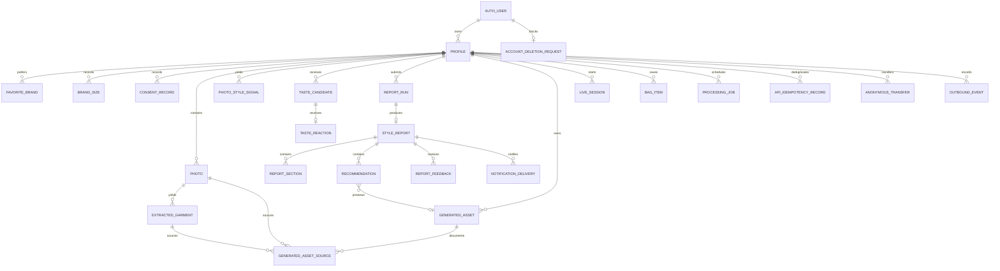
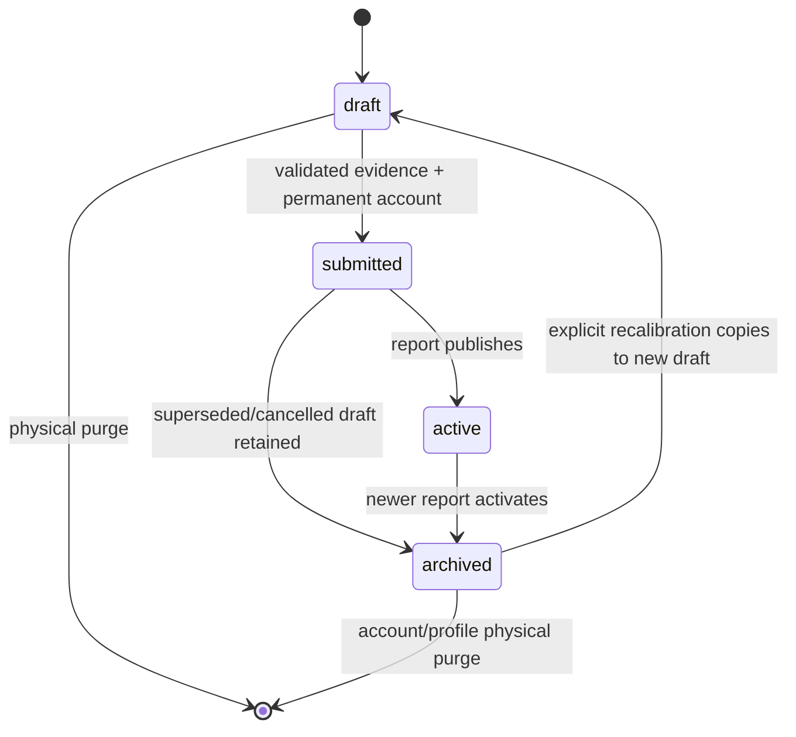
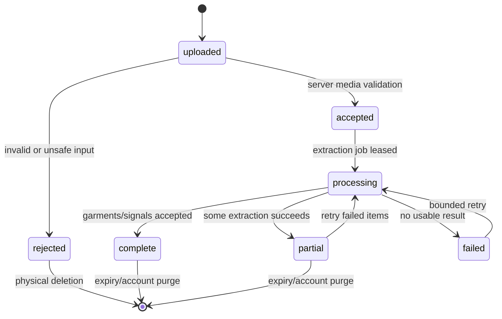
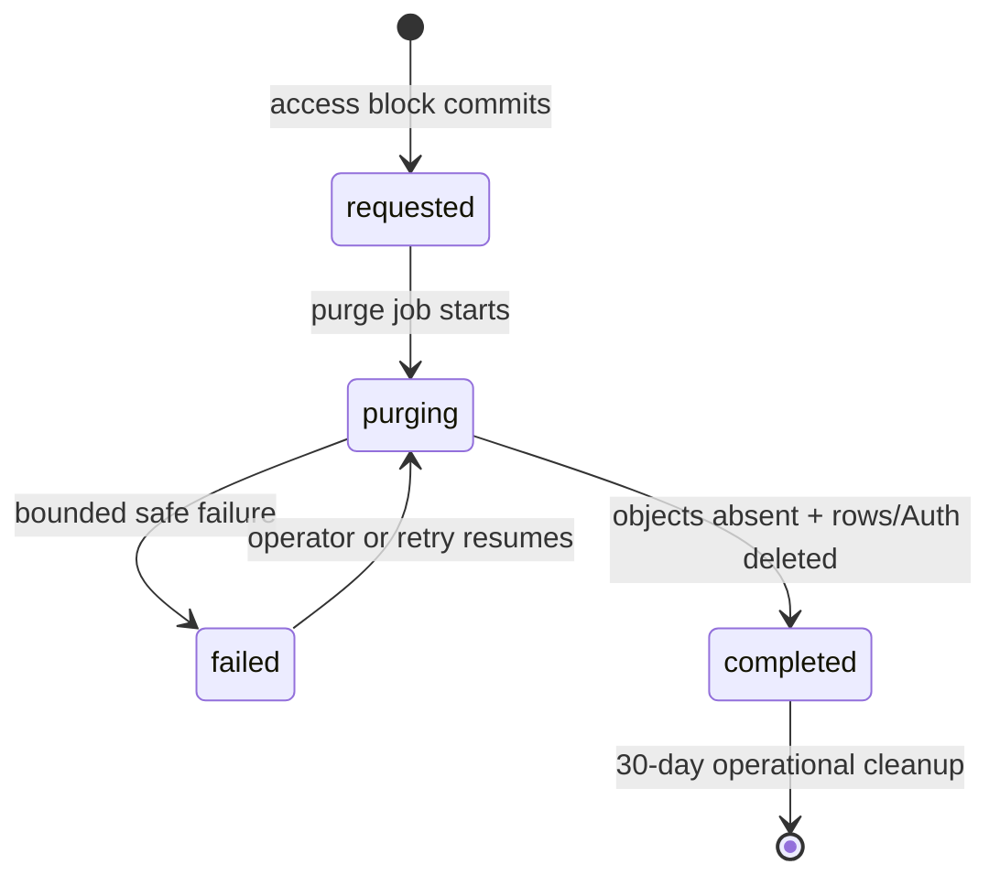

# Data Contract

- **Status:** Approved data contract; cross-contract repairs applied
- **Date:** 2026-07-20
- **Database:** Supabase Postgres
- **Binary storage:** Supabase private Storage
- **Schema style:** lowercase `snake_case`, UTC `timestamptz`, text plus named check constraints for bounded enums

This contract is exact enough to produce migrations and shared Zod schemas. It defines persistence only; HTTP operations and screen mappings belong to the later application-contract checkpoint.

## Data-review repair record

| Finding | Repair in this version |
|---|---|
| DR-001 | Customer-input evidence freezes at submission; named system-output children and their narrow mutable fields are explicitly allowed afterward. |
| DR-002 | Report runs now have bounded sequences, request idempotency, failed-history retention, and one live/succeeded partial uniqueness. |
| DR-003 | Photo signals and extracted garments now expire no later than their photos; bounded candidates/reactions/reports survive without detailed extraction rows. |
| DR-004 | Every likeness asset references the exact granted generation-consent event until physical purge. |
| DR-005 | Report versions are owner-level across derived profiles with explicit prior-report lineage and publish locking. |
| DR-006 | Job errors use a `job_kind`-discriminated, bounded operation-stage schema. |
| DR-007 | Global cleanup indexes now lead with each due timestamp and terminal predicate. |
| DR-008 | A complete row-state invariant/transition matrix assigns database versus transaction enforcement. |
| DR-009 | Same-owner FKs are deferrable, and the transfer function has exact locks, preconditions, cascade behavior, and a populated migration test. |
| DR-010 | Storage reads now authorize against current relational ownership, so immutable objects survive account transfer without a copy/rename saga. |
| DR-011 | Expiring rows, authenticated object reads, and signed URLs fail closed at the logical deadline even when physical purge retries. |
| DR-012 | Every photo has a non-null deadline at creation; bounded activity/report extensions cannot revive expired evidence. |
| DR-013 | A minimal private deletion request plus a caller-derived policy function blocks every customer operation before asynchronous purge. |
| CR-001 | Favorite brands are now a distinct ordered record, while category sizes carry an exact `known`, `unknown`, or `not_applicable` status. |
| CR-002 | Photo upload now uses a server-created Supabase signed upload token plus a signed completion token; customers have no general Storage insert grant. |
| CR-003 | Photo order is an explicit draft mutation backed by a deferrable unique position constraint. |
| CR-004 | Live sessions require camera consent at creation, add microphone/visual consent only when Gemini is enabled, and persist only bounded sequence/result-set state needed to reject stale actions. |
| CR-005 | General API idempotency now has a bounded private record; durable outcomes replay by subject while upload, handoff, and realtime credentials are re-minted rather than persisted. |
| CR-006 | Photo replacement now validates the new object before an atomic same-position metadata swap and makes the old object inaccessible before physical cleanup. |
| CR-007 | Recommendations can form deterministic report-local suggested-outfit groups without persisting mutable retailer facts. |

## Contract decisions

1. `auth.users.id` is identity authority. Anonymous sign-ins are real users and therefore use the `authenticated` Postgres role; `anon` receives no customer-data grants.
2. Customer-visible identifiers use `uuid default gen_random_uuid()`. Sequential identities would be denser, but opaque URL-safe IDs avoid a second public identifier and the hackathon volume does not justify a UUIDv7 extension.
3. Every customer-owned `public` row carries `owner_id uuid not null`. Child tables use composite foreign keys to `(owner_id, parent_id)` so ownership cannot diverge from the parent.
4. A submitted profile is an immutable evidence set. Corrections create a new draft with `derived_from_profile_id`; completed reports remain reproducible rather than silently changing beneath the customer.
5. Provider bodies, transcripts, prompts, copied Shopify payloads/images, and raw media bytes are never stored in Postgres. JSONB is used only for the bounded shapes specified below.
6. Media objects are immutable. Replacing a photo creates a new object/row; signed upload tokens are issued with upsert disabled.
7. Public schema exposure is explicit. Each migration grants only named operations in addition to enabling RLS; current Supabase projects do not automatically expose new tables through the Data API.
8. Worker, request-idempotency, transfer-token, account-deletion, notification, and outbound-event records live in non-exposed `private`; customer roles receive no table access. `authenticated` receives narrowly scoped schema usage and execute only for the no-argument access-check function used by RLS.
9. No customer-data soft deletion column exists. A minimal private account-deletion request is an authorization block and purge-control record, not retained product data; customer access is revoked first, objects are deleted, and rows are then physically removed.
10. A Storage path records the creation owner for immutable naming only. Current authorization always comes from the unexpired matching Postgres metadata row, so anonymous-to-existing-account transfer never copies or renames object bytes.
11. Logical expiry is the customer-access boundary. Physical deletion is idempotent cleanup and may retry without extending access.

## Entity relationship diagram



`AUTH_USER` is `auth.users`. `PROCESSING_JOB`, `API_IDEMPOTENCY_RECORD`, `ANONYMOUS_TRANSFER`, `ACCOUNT_DELETION_REQUEST`, `NOTIFICATION_DELIVERY`, and `OUTBOUND_EVENT` are private operational tables. The deletion request intentionally has no foreign key to `auth.users` so its access block and non-sensitive completion evidence survive Auth-user deletion for the bounded operational window.

## Shared conventions

### Identifiers and timestamps

- Primary keys: `uuid primary key default gen_random_uuid()`.
- `owner_id`: `uuid references auth.users(id) on delete cascade`; never accepted from an untrusted request.
- Every public table declares `unique (owner_id, id)`. This supplies the composite parent key and an owner-leading index for RLS.
- True owned-child keys use `(owner_id, parent_id) references parent(owner_id, id) on update cascade on delete cascade deferrable initially immediate`. Owner updates occur only inside the private transfer transaction after `set constraints all deferred`.
- Optional lineage/source references that must survive source expiry use a simple ID FK with `on delete set null`; their server-only creating transaction validates same-owner identity. They never establish access—RLS still keys only on the row's own `owner_id`.
- Other foreign keys use `on delete restrict` unless physical parent deletion must remove the child. Stable external references use text, not foreign keys.
- `created_at`: `timestamptz not null default now()`.
- Mutable records also have `updated_at timestamptz not null default now()` maintained by one reused `private.set_updated_at()` trigger function.
- Completion and lease timestamps are nullable until their named transition occurs. Expiry nullability follows the exact record contract; sensitive photos and generated assets always have non-null deadlines.
- All text is UTF-8. Use `text`; enforce product limits with checks or Zod rather than `varchar(n)`.

### Bounded text limits

| Value | Limit |
|---|---:|
| Customer name | 120 characters |
| Gender self-description | 80 characters |
| Brand/category/size labels | 80 / 80 / 40 characters |
| Short title/label | 120 characters |
| Summary/rationale/customer feedback | 2,000 characters |
| Operational error code | 80 characters |
| Catalog/shop/variant reference | 512 characters |

Whitespace-only values fail validation. Catalog references are opaque case-sensitive strings and are never normalized by lowercasing.

## Bounded enum values

These are `text` columns with named check constraints, not Postgres enum types, so additive compatibility changes do not require enum recreation.

| Domain | Allowed values |
|---|---|
| `profile_status` | `draft`, `submitted`, `active`, `archived` |
| `onboarding_step` | `welcome`, `personal_details`, `brand_sizing`, `photos`, `photo_review`, `taste`, `account`, `profile_review`, `complete` |
| `consent_purpose` | `profile_processing`, `photo_analysis`, `garment_extraction`, `generated_likeness_preview`, `account_connection`, `live_camera`, `live_microphone`, `gemini_visual_context` |
| `consent_decision` | `granted`, `revoked` |
| `brand_size_status` | `known`, `unknown`, `not_applicable` |
| `photo_status` | `uploaded`, `accepted`, `rejected`, `processing`, `partial`, `complete`, `failed` |
| `asset_kind` | `garment_cutout`, `wardrobe_preview`, `tryon_still` |
| `asset_status` | `processing`, `accepted`, `rejected`, `failed` |
| `garment_source_kind` | `wardrobe_extraction`, `direct_photo_signal` |
| `garment_review_status` | `not_required`, `pending`, `confirmed`, `rejected` |
| `candidate_source` | `extracted_garment`, `shopify_catalog`, `curated_fallback` |
| `candidate_status` | `ready`, `unavailable`, `retired` |
| `taste_reaction` | `love`, `hate`, `maybe` |
| `report_run_status` | `queued`, `processing`, `succeeded`, `failed`, `cancelled` |
| `report_stage` | `queued`, `profile_analysis`, `catalog_matching`, `report_writing`, `preview_generation`, `finalizing` |
| `report_section_type` | `overview`, `color`, `body_style` |
| `feedback_kind` | `helpful`, `unclear`, `incorrect`, `recalibrate` |
| `feedback_status` | `open`, `applied`, `dismissed` |
| `live_status` | `created`, `connecting`, `ready`, `reconnecting`, `ended`, `failed` |
| `bag_source` | `recommendation`, `live_session`, `product_detail` |
| `job_kind` | `photo_extraction`, `taste_candidates`, `report_generation`, `wardrobe_preview`, `report_notification`, `retention_purge` |
| `job_status` | `queued`, `leased`, `retry_wait`, `succeeded`, `failed`, `cancelled` |
| `transfer_status` | `prepared`, `consumed`, `expired`, `cancelled` |
| `account_deletion_status` | `requested`, `purging`, `failed`, `completed` |
| `delivery_status` | `queued`, `sent`, `failed` |
| `outbound_event_type` | `retailer_handoff` |

## Public customer-owned records

### `public.profiles`

| Column | Type / default | Null | Rules |
|---|---|---|---|
| `id` | uuid / generated | no | Primary key |
| `owner_id` | uuid | no | FK `auth.users`; unique partner with `id` |
| `derived_from_profile_id` | uuid | yes | Same-owner profile; cannot equal `id` |
| `status` | text / `draft` | no | `profile_status` |
| `current_step` | text / `welcome` | no | `onboarding_step` |
| `revision` | integer / 1 | no | `>= 1`; increments on every accepted draft mutation |
| `name` | text | yes | Trimmed, 1–120 when present |
| `age` | smallint | yes | 18–120 when present |
| `adult_confirmed_at` | timestamptz | yes | Required before `submitted` |
| `gender` | text | yes | Inclusive/self-described, 1–80 when present |
| `height_cm` | numeric(5,2) | yes | 80–250 |
| `weight_kg` | numeric(5,2) | yes | Optional; 25–400 when present |
| `submitted_at` | timestamptz | yes | Required when status is not `draft` |
| `last_activity_at` | timestamptz / now | no | Anonymous cleanup query authority |
| `created_at` | timestamptz / now | no | Immutable |
| `updated_at` | timestamptz / now | no | Trigger maintained |

Constraints:

- `unique (owner_id, id)` supports composite child ownership.
- Partial unique index permits at most one `active` profile per owner.
- A non-draft profile requires name, age, adult confirmation, gender, height, and `current_step='complete'`.
- Only a draft may change customer-input evidence: profile fields, favorite brands, brand sizes, photos, photo signals, extracted garments, taste candidates, and reactions. Those rows freeze at submission except garment review completed by the already-running extraction pipeline.
- A submitted or active profile may receive system-output children: report runs, immutable reports/sections/recommendations, generated assets/lineage, feedback, live sessions, and bag items. Report-output records are insert-only except for the explicitly named preview attachment, status, and lifecycle fields.
- `derived_from_profile_id` uses a simple `on delete set null` lineage FK; draft creation validates the same owner. It is null only for the first profile or after an intentionally purged source profile.

Evidence/output mutation matrix:

| Record | Draft | Submitted | Active/archived |
|---|---|---|---|
| Profile answers, favorite brands, brand sizes, photos, candidates, reactions | create/update | frozen | frozen |
| Photo signals and extracted garments | create/update while extraction is pending | complete already-enqueued work only | frozen until expiry purge |
| Report runs/reports/sections/recommendations | none | create/publish | read; recommendation may attach one accepted preview from null |
| Generated assets and lineage | cutouts may be created | cutouts/previews may complete | previews/try-on assets may be created; lifecycle status/expiry only |
| Feedback, live sessions, bag | none | feedback only after report publish | named customer/system transitions only |

### `public.favorite_brands`

| Column | Type / default | Null | Rules |
|---|---|---|---|
| `id`, `owner_id`, `profile_id` | uuid | no | Composite owner/profile FK |
| `brand_name` | text | no | Trimmed 1–80; customer spelling preserved |
| `brand_key` | text | no | Application-normalized lowercase/whitespace key, 1–80 |
| `preference_order` | smallint | no | 1–20 |
| `created_at`, `updated_at` | timestamptz | no | Standard timestamps |

Unique `(profile_id, brand_key)` and `(profile_id, preference_order)`. A complete profile has 1–20 favorite brands. Rows are mutable only while the parent is a draft. A favorite brand may have zero or more category-size rows; selecting a brand never invents a category or size.

### `public.brand_sizes`

| Column | Type / default | Null | Rules |
|---|---|---|---|
| `id`, `owner_id`, `profile_id` | uuid | no | Composite owner/profile FK |
| `brand_name` | text | no | Trimmed 1–80; customer spelling preserved |
| `brand_key` | text | no | Application-normalized lowercase/whitespace key, 1–80 |
| `category` | text | no | Trimmed 1–80, e.g. `jeans`, `tops` |
| `size_status` | text | no | `known`, `unknown`, or `not_applicable` |
| `size_label` | text | yes | Trimmed 1–40 only when `size_status='known'`, e.g. `26`, `M` |
| `preference_order` | smallint | no | 1–20 |
| `created_at`, `updated_at` | timestamptz | no | Standard timestamps |

Unique `(profile_id, brand_key, lower(category))`; maximum 20 rows per profile is enforced when profile completion is submitted. `known` requires a nonblank `size_label`; `unknown` and `not_applicable` require it to be null. Every `brand_key` must match an owned `favorite_brands` row for the same profile. Rows are mutable only while the parent is a draft.

### `public.consent_records`

| Column | Type / default | Null | Rules |
|---|---|---|---|
| `id`, `owner_id`, `profile_id` | uuid | no | Composite owner/profile FK |
| `purpose` | text | no | `consent_purpose` |
| `decision` | text | no | `granted` or `revoked` |
| `policy_version` | text | no | Immutable application version, 1–80 |
| `copy_sha256` | bytea | no | Exactly 32 bytes; proves the presented copy version |
| `captured_at` | timestamptz / now | no | Event time |
| `created_at` | timestamptz / now | no | Immutable |

Consent is append-only: authenticated users may select and insert owned rows; no update or delete grant. Current consent is the latest `(captured_at, id)` event per purpose. Revocation prevents new processing and schedules affected derived assets for physical purge.

### `public.photos`

| Column | Type / default | Null | Rules |
|---|---|---|---|
| `id`, `owner_id`, `profile_id` | uuid | no | Composite owner/profile FK |
| `storage_path` | text | no | Unique immutable private-object path; creation-owner segment is not authorization authority |
| `status` | text / `uploaded` | no | `photo_status` |
| `position` | smallint | no | 1–12; unique per profile |
| `media_type` | text | no | `image/jpeg`, `image/png`, `image/webp`, `image/heic`, or `image/heif` |
| `byte_size` | bigint | no | 1–15,728,640 bytes |
| `width_px`, `height_px` | integer | no | Each 640–12,000 after decode |
| `sha256` | bytea | no | Exactly 32 bytes; duplicate detection |
| `rejection_code` | text | yes | Stable bounded machine code only when rejected |
| `accepted_at` | timestamptz | yes | Set after server verification |
| `expires_at` | timestamptz | no | Initial draft deadline; bounded server-only activity/report extension below |
| `created_at`, `updated_at` | timestamptz | no | Standard timestamps |

The `(profile_id, position)` uniqueness is a named `deferrable initially immediate` constraint so the server can defer it inside one photo-reorder or photo-replacement transaction; `(profile_id, sha256)` remains immediately unique. Reorder locks the owned draft profile and all of its photo rows, requires the submitted IDs to be the exact current set with no duplicates, assigns positions 1..N, increments the profile revision once, and makes no object change. A replacement slot is bound to the exact old photo ID, position, owner, profile revision, and new object path. Completion locks that old row, verifies it is still current, defers position uniqueness, inserts the verified replacement, deletes the old row/cascades, and increments revision once. After commit the server deletes the known old object; a failed physical delete leaves an inaccessible orphan for reconciliation and never restores the old customer-visible row. Completion requires 8–12 accepted photos in one server transaction. A rejected photo does not affect accepted siblings. Photo rows are server-written after Storage verification; customers can select owned, unexpired metadata and request deletion through the API.

Every uploaded/rejected/accepted photo receives `expires_at = now() + interval '7 days'` in its server metadata-creation transaction. While the anonymous profile remains an unexpired draft, a validated accepted customer activity may move every still-unexpired photo and derived child deadline to no later than `activity_at + interval '7 days'`; direct customer writes cannot change a deadline. Report publication may move each still-unexpired source-photo deadline once to `report.created_at + interval '30 days'`. Neither path may update a row whose existing deadline is at or before transaction time, and consent revocation or deletion may only shorten it. Derived deadlines remain less than or equal to their source-photo deadline; a shorter derived deadline need not be extended.

### `public.photo_style_signals`

One bounded direct-analysis record per photo supports the Wardrobe failure fallback.

| Column | Type / default | Null | Rules |
|---|---|---|---|
| `id`, `owner_id`, `profile_id`, `photo_id` | uuid | no | Same-owner FKs; unique photo |
| `dominant_colors` | text[] / `{}` | no | At most 8 entries, each 1–40 |
| `categories` | text[] / `{}` | no | At most 8 entries, each 1–80 |
| `silhouettes` | text[] / `{}` | no | At most 6 entries, each 1–80 |
| `aesthetic_tags` | text[] / `{}` | no | At most 12 entries, each 1–80 |
| `confidence` | numeric(4,3) | no | 0–1 |
| `provider_name`, `provider_model` | text | no | Bounded provenance labels, not credentials |
| `expires_at` | timestamptz | no | Equal to or earlier than source photo expiry |
| `created_at` | timestamptz / now | no | Immutable for the photo revision |

### `public.extracted_garments`

| Column | Type / default | Null | Rules |
|---|---|---|---|
| `id`, `owner_id`, `profile_id`, `source_photo_id` | uuid | no | Same-owner FKs |
| `source_kind` | text | no | `garment_source_kind` |
| `category` | text | no | 1–80 |
| `colors`, `materials`, `patterns` | text[] / `{}` | no | Each array at most 8; entry 1–80 |
| `silhouette`, `fit` | text | yes | Each 1–80 when present |
| `confidence` | numeric(4,3) | no | 0–1 |
| `duplicate_group_id` | uuid | yes | Groups likely duplicates within one profile |
| `review_status` | text / `not_required` | no | `garment_review_status` |
| `provider_name`, `provider_model` | text | no | Bounded provenance |
| `expires_at` | timestamptz | no | Equal to or earlier than source photo expiry |
| `created_at`, `updated_at` | timestamptz | no | Review may update; extracted content does not |

At most 20 garments per photo. `review_status` supports the spike's possible customer-review decision without making review required. Rejected garments cannot source candidates or previews. The retention worker deletes extracted garments and direct photo signals no later than the source photo; the immutable report and bounded candidate/reaction descriptors remain as aggregate customer evidence.

### `public.taste_candidates`

| Column | Type / default | Null | Rules |
|---|---|---|---|
| `id`, `owner_id`, `profile_id` | uuid | no | Composite owner/profile FK |
| `source` | text | no | `candidate_source` |
| `extracted_garment_id` | uuid | yes | Simple ID FK `on delete set null`; server verifies same-owner garment at creation |
| `source_fingerprint` | bytea | yes | Exactly 32 bytes for extracted source; non-reversible dedup/provenance key |
| `catalog_product_ref` | text | yes | Stable Shopify product reference only |
| `catalog_variant_ref`, `catalog_shop_ref` | text | yes | Stable reference when available |
| `curated_asset_key` | text | yes | Approved non-customer fixture key, not an arbitrary URL |
| `category`, `color_family`, `silhouette` | text | no | Each trimmed 1–80 |
| `representation_tags` | text[] / `{}` | no | At most 8 bounded non-sensitive balancing labels |
| `position` | smallint | no | 1–20; unique per profile |
| `status` | text / `ready` | no | `candidate_status` |
| `created_at`, `updated_at` | timestamptz | no | Standard timestamps |

Exactly one source family is present:

- `extracted_garment`: `source_fingerprint` is required; `extracted_garment_id` is required at creation and may become null only through the FK's expiry purge;
- `shopify_catalog`: product and shop refs, optional variant ref;
- `curated_fallback`: `curated_asset_key` only.

The database stores no Shopify image URL, copied product body, price, inventory, or merchant claim. The completion contract requires 12 reactions and permits up to 20 candidates. Candidate generation balances category, color, silhouette, and representation tags before assigning position. Candidate descriptors and reactions intentionally survive source-garment purge; they are bounded preference evidence, not retained photo-derived pixels or detailed extraction output.

### `public.taste_reactions`

| Column | Type / default | Null | Rules |
|---|---|---|---|
| `id`, `owner_id`, `profile_id`, `candidate_id` | uuid | no | Same-owner FKs; one row per candidate |
| `reaction` | text | no | `love`, `hate`, or `maybe` |
| `undone_at` | timestamptz | yes | Non-null means not counted; preserves undo evidence |
| `created_at`, `updated_at` | timestamptz | no | Standard timestamps |

Unique `(profile_id, candidate_id)`. A new reaction is an insert; changing Love/Hate/Maybe or undoing updates that owned row while the parent profile is a draft. The report input counts only rows where `undone_at is null`.

### `public.report_runs`

| Column | Type / default | Null | Rules |
|---|---|---|---|
| `id`, `owner_id`, `profile_id` | uuid | no | Submitted same-owner profile |
| `profile_revision` | integer | no | Must equal frozen profile revision at creation |
| `status` | text / `queued` | no | `report_run_status` |
| `stage` | text / `queued` | no | `report_stage` |
| `run_sequence` | smallint / 1 | no | 1–3 user-visible submission/retry sequence |
| `idempotency_key` | text | no | Unique per request; server-derived from profile ID/revision/run sequence plus client request key |
| `attempt_count` | smallint / 0 | no | 0–2 |
| `started_at`, `completed_at` | timestamptz | yes | State-consistent timestamps |
| `last_error_code` | text | yes | Allowlisted stable code, maximum 80 |
| `last_error_details` | jsonb | yes | Exact safe shape below; never provider response |
| `created_at`, `updated_at` | timestamptz | no | Standard timestamps |

Unique `(profile_id, profile_revision, run_sequence)`. A partial unique index permits at most one row for `(profile_id, profile_revision)` where status is `queued`, `processing`, or `succeeded`. Failed/cancelled runs remain as bounded history and release that slot. A customer retry creates the next sequence with a new request-level idempotency key; replay of that request returns the same run. At most three sequences are permitted. If any succeeded report exists, it always wins and later retry creation conflicts. Each run permits at most two internal worker attempts and retry never changes profile evidence.

Safe error JSON is exactly:

```json
{
  "retryable": true,
  "stage": "report_writing",
  "customer_message_key": "analysis_temporarily_unavailable"
}
```

No extra keys are accepted. Each value is bounded by its corresponding enum or 120-character message key.

### `public.style_reports`

| Column | Type / default | Null | Rules |
|---|---|---|---|
| `id`, `owner_id`, `profile_id`, `report_run_id` | uuid | no | Same-owner FKs; unique run |
| `derived_from_report_id` | uuid | yes | Same-owner prior report at creation; simple `on delete set null` lineage FK |
| `version` | integer | no | `>= 1`; unique owner/version |
| `title` | text | no | 1–120 |
| `summary` | text | no | 1–2,000 |
| `confidence_note` | text | no | 1–500; interpretive/non-diagnostic disclosure |
| `method_version` | text | no | Internal report-contract version, 1–80 |
| `provider_name`, `provider_model` | text | no | Bounded provenance |
| `created_at` | timestamptz / now | no | Immutable |

A report publishes atomically only after every required section parses. It never stores raw model output. The publish transaction locks the owner's current active profile when one exists, assigns `version = previous version + 1` and `derived_from_report_id = previous report`; the first report uses version 1. Unique `(owner_id, version)` is the final concurrency guard, and a collision retries the short publish transaction without repeating provider work. Activating this report changes the profile from `submitted` to `active` and archives the previous active profile in the same transaction.

### `public.report_sections`

| Column | Type / default | Null | Rules |
|---|---|---|---|
| `id`, `owner_id`, `profile_id`, `report_id` | uuid | no | Same-owner FKs |
| `section_type` | text | no | `overview`, `color`, or `body_style` |
| `position` | smallint | no | 1–3; must match canonical section order |
| `content` | jsonb | no | One exact discriminated shape below |
| `created_at` | timestamptz / now | no | Immutable |

Unique `(report_id, section_type)` and `(report_id, position)`. Required order is overview 1, color 2, body_style 3.

`overview` content:

```json
{
  "style_identity": "string, 1-120",
  "summary": "string, 1-2000",
  "strengths": [
    {"label": "string, 1-80", "explanation": "string, 1-500"}
  ],
  "priorities": [
    {"label": "string, 1-80", "explanation": "string, 1-500"}
  ]
}
```

`strengths` and `priorities` each contain 1–6 entries.

`color` content:

```json
{
  "palette_name": "string, 1-120",
  "summary": "string, 1-2000",
  "best_colors": [
    {"name": "string, 1-80", "hex": "#RRGGBB", "reason": "string, 1-500"}
  ],
  "approach_with_care": [
    {"name": "string, 1-80", "hex": "#RRGGBB", "reason": "string, 1-500"}
  ]
}
```

`best_colors` contains 4–12 entries; `approach_with_care` contains 0–6. Hex values are presentation references, not scientific measurements.

`body_style` content:

```json
{
  "kibbe_informed_family": "string, 1-120",
  "summary": "string, 1-2000",
  "shape_guidance": [
    {"label": "string, 1-80", "explanation": "string, 1-500"}
  ],
  "proportion_guidance": [
    {"label": "string, 1-80", "explanation": "string, 1-500"}
  ],
  "disclosure": "string, 1-500"
}
```

Both guidance arrays contain 1–8 entries. The disclosure must state that the result is interpretive styling guidance, not an objective, medical, or value judgment.

### `public.recommendations`

| Column | Type / default | Null | Rules |
|---|---|---|---|
| `id`, `owner_id`, `profile_id`, `report_id` | uuid | no | Same-owner FKs |
| `position` | smallint | no | 1–24; unique report position |
| `category` | text | no | 1–80 |
| `title` | text | no | 1–120; Magic Mirror recommendation label, not cached retailer title |
| `rationale`, `styling_note` | text | no | Each 1–2,000 |
| `catalog_product_ref`, `catalog_shop_ref` | text | no | Stable opaque Shopify references |
| `catalog_variant_ref` | text | yes | Stable variant reference when selected |
| `preview_asset_id` | uuid | yes | Same-owner accepted `wardrobe_preview` asset |
| `outfit_group_key` | text | yes | Stable report-local grouping key, 1–80; all three outfit columns are set or null together |
| `outfit_group_title` | text | yes | Customer-facing outfit label, 1–120 |
| `outfit_item_position` | smallint | yes | 1–6 within the outfit group |
| `created_at` | timestamptz / now | no | Immutable report evidence |

Product title, seller display name, price, inventory, retailer URL, and images are refreshed live and are never report authority. Rows with the same non-null `outfit_group_key` form one suggested outfit; the report-local title and position are immutable guidance while every product fact is refreshed live. The database enforces that the three grouping fields are either all null or all present, and a partial unique index prevents duplicate positions within a report/group. If catalog refresh or generated preview fails, rationale plus current product link fallback still completes the report.

### `public.report_feedback`

| Column | Type / default | Null | Rules |
|---|---|---|---|
| `id`, `owner_id`, `profile_id`, `report_id` | uuid | no | Same-owner FKs |
| `section_type` | text | yes | `report_section_type`; null for whole-report feedback |
| `kind` | text | no | `feedback_kind` |
| `note` | text | yes | Trimmed 1–2,000 when supplied |
| `status` | text / `open` | no | `feedback_status` |
| `created_at`, `updated_at` | timestamptz | no | Standard timestamps |

Feedback never mutates the report in place. `recalibrate` creates a derived draft after confirmation; applying feedback records the new report path separately.

### `public.generated_assets`

| Column | Type / default | Null | Rules |
|---|---|---|---|
| `id`, `owner_id`, `profile_id` | uuid | no | Composite owner/profile FK |
| `kind` | text | no | `asset_kind` |
| `status` | text / `processing` | no | `asset_status` |
| `generation_consent_record_id` | uuid | yes | Required for `wardrobe_preview` and `tryon_still`; same-owner granted likeness consent |
| `storage_path` | text | yes | Unique; required only for accepted asset |
| `media_type` | text | yes | PNG, JPEG, or WebP for accepted asset |
| `byte_size`, `width_px`, `height_px` | bigint/integer | yes | Required and bounded for accepted asset |
| `sha256` | bytea | yes | Exactly 32 bytes for accepted asset |
| `provider_name`, `provider_model` | text | no | Bounded provenance |
| `rejection_code` | text | yes | Stable safe code when rejected/failed |
| `expires_at` | timestamptz | no | Same/shorter than source; previews max 30 days |
| `created_at`, `updated_at` | timestamptz | no | Standard timestamps |

Accepted assets require all object metadata and no rejection code. Rejected/failed assets have no customer-readable object path. A row never changes `kind` or ownership. `wardrobe_preview` and `tryon_still` creation validates that `generation_consent_record_id` references an owned `generated_likeness_preview` event with `decision='granted'`; `garment_cutout` requires null. That immutable consent reference remains until the asset is physically deleted even if a later revocation schedules the asset for purge.

### `public.generated_asset_sources`

| Column | Type / default | Null | Rules |
|---|---|---|---|
| `id`, `owner_id`, `profile_id`, `asset_id` | uuid | no | Same-owner FKs |
| `source_photo_id` | uuid | yes | Same-owner photo |
| `source_garment_id` | uuid | yes | Same-owner extracted garment |
| `catalog_product_ref`, `catalog_shop_ref` | text | yes | Stable refs only |
| `catalog_image_transmitted` | boolean / false | no | Explicit evidence flag, not permission claim |
| `created_at` | timestamptz / now | no | Immutable lineage |

Exactly one source family is set per row: photo, garment, or catalog product+shop. A generated asset requires at least one customer-photo source. If `catalog_image_transmitted=true`, the implementation also records the founder-accepted hackathon risk in the generation job evidence; the flag does not assert merchant permission.

### `public.live_sessions`

| Column | Type / default | Null | Rules |
|---|---|---|---|
| `id`, `owner_id`, `profile_id` | uuid | no | Active same-owner profile |
| `status` | text / `created` | no | `live_status` |
| `selected_recommendation_id` | uuid | yes | Same-owner recommendation |
| `catalog_product_ref`, `catalog_shop_ref` | text | yes | Stable current selection refs |
| `catalog_variant_ref` | text | yes | Stable selected variant |
| `camera_consent_record_id` | uuid | no | Latest granted same-owner camera consent at session creation |
| `microphone_consent_record_id` | uuid | yes | Set only when Gemini voice is enabled; latest granted same-owner consent |
| `gemini_visual_consent_record_id` | uuid | yes | Required only if sampled video/screen context is transmitted |
| `gemini_context_mode` | text | yes | `structured_state` or `sampled_video`; set only when Gemini is enabled |
| `result_set_id` | uuid | yes | Current transient catalog-result identity; no product payload is stored |
| `last_action_sequence` | bigint / 0 | no | `>= 0`; conditional update rejects stale/duplicate proposals |
| `connection_ms`, `first_frame_ms`, `last_action_latency_ms` | integer | yes | Each 0–600,000; aggregate timing only |
| `last_error_code` | text | yes | Stable safe code, maximum 80 |
| `started_at`, `ended_at` | timestamptz | yes | State-consistent |
| `created_at`, `updated_at` | timestamptz | no | Standard timestamps |

No provider credential, provider session identifier, camera/video frame, audio, transcript, raw gesture frame, catalog payload, or Gemini/Decart payload is persisted. `ended` and `failed` are terminal. Session creation requires camera consent only. Enabling Gemini atomically records microphone consent plus context mode; `structured_state` requires no visual-context consent, while `sampled_video` requires the latest granted visual-context consent. Disabling voice does not end Decart or the live session.

### `public.bag_items`

| Column | Type / default | Null | Rules |
|---|---|---|---|
| `id`, `owner_id`, `profile_id` | uuid | no | Active permanent-account profile |
| `source` | text | no | `bag_source`; durable provenance category |
| `catalog_product_ref`, `catalog_shop_ref` | text | no | Stable opaque Shopify references |
| `catalog_variant_ref` | text | yes | Stable chosen variant |
| `source_recommendation_id`, `source_live_session_id` | uuid | yes | Simple lineage FKs `on delete set null`; same-owner validated at save |
| `saved_at` | timestamptz / now | no | Sort/cursor authority |
| `created_at` | timestamptz / now | no | Immutable |

Unique tuple `(profile_id, catalog_shop_ref, catalog_product_ref, coalesce(catalog_variant_ref, ''))`. Source checks require the matching lineage ID at creation for `recommendation` or `live_session`; the ID may later become null only through its source-retention purge, while `source` preserves bounded provenance. `product_detail` forbids both IDs. Bag rows never cache price, availability, retailer URL, title, or image. Anonymous account transfer cannot contain bag rows; a later explicit bag merge, if added to an authenticated flow, deduplicates only by this stable tuple.

## Private operational records

`private` is not an exposed Data API schema. Revoke all table access from `PUBLIC`, `anon`, and `authenticated`. Only the server/worker credential accesses tables; `authenticated` later receives schema usage plus execute on the one caller-derived boolean access-check function and nothing else.

### `private.processing_jobs`

| Column | Type / default | Null | Rules |
|---|---|---|---|
| `id`, `owner_id`, `profile_id` | uuid | no | Owner/profile references |
| `kind` | text | no | `job_kind` |
| `subject_id` | uuid | no | ID interpreted only by `kind` |
| `status` | text / `queued` | no | `job_status` |
| `priority` | smallint / 100 | no | 0–1,000; lower claims first |
| `idempotency_key` | text | no | Globally unique bounded key |
| `attempt_count`, `max_attempts` | smallint / 0, 2 | no | `0 <= attempt_count <= max_attempts <= 3` |
| `available_at` | timestamptz / now | no | Claim eligibility |
| `leased_at`, `lease_expires_at` | timestamptz | yes | Both present only while leased |
| `worker_id` | text | yes | Opaque deployment instance ID, max 120 |
| `last_error_code` | text | yes | Stable safe code |
| `last_error_details` | jsonb | yes | Exact job-safe discriminated shape below |
| `completed_at` | timestamptz | yes | Terminal timestamp |
| `created_at`, `updated_at` | timestamptz | no | Standard timestamps |

The claim index is `(priority, available_at, created_at, id)` where status is `queued` or `retry_wait`. A private claim function performs one short `for update skip locked` claim/update and returns one row. Provider calls occur after commit; no external call holds a database lock. Stale leased jobs become claimable only after `lease_expires_at`, incrementing attempt count once.

Job error JSON is exactly:

```json
{
  "job_kind": "photo_extraction",
  "operation_stage": "analysis",
  "retryable": true,
  "customer_message_key": "photo_analysis_temporarily_unavailable"
}
```

No extra keys are accepted. `job_kind` must equal the row. `operation_stage` is validated by this map:

| Job kind | Allowed operation stages |
|---|---|
| `photo_extraction` | `decode`, `analysis`, `cutout`, `persist` |
| `taste_candidates` | `seed`, `balance`, `persist` |
| `report_generation` | `profile_analysis`, `catalog_matching`, `report_writing`, `finalizing` |
| `wardrobe_preview` | `source_prepare`, `generate`, `quality_check`, `persist` |
| `report_notification` | `resolve_recipient`, `send` |
| `retention_purge` | `enumerate`, `delete_object`, `delete_rows`, `reconcile` |

The mapping is a shared Zod discriminated union; database checks bound `job_kind`, text length, JSON object type, and allowed top-level keys without storing provider bodies.

### `private.api_idempotency_records`

| Column | Type / default | Null | Rules |
|---|---|---|---|
| `id`, `owner_id` | uuid | no | Server-derived current Auth subject; primary ID is generated |
| `operation` | text | no | Allowlisted API `operationId`, maximum 80 |
| `idempotency_key` | uuid | no | Exact client header value |
| `request_sha256` | bytea | no | Exactly 32 bytes over canonical validated input |
| `subject_kind` | text | no | Allowlisted bounded result kind, maximum 80 |
| `subject_id` | uuid | yes | Durable result row when one exists |
| `subject_revision` | integer | yes | Exact result revision/sequence when needed to reconstruct |
| `http_status` | smallint | no | Original 2xx status only |
| `expires_at` | timestamptz | no | At most 24 hours after creation |
| `created_at` | timestamptz / now | no | Immutable |

Unique `(owner_id, operation, idempotency_key)`. The operation transaction creates the domain result and this record atomically. A replay with the same request hash reconstructs the safe current projection of that exact subject/revision; a different hash returns `IDEMPOTENCY_KEY_REUSED`. No response body, customer text, email, product payload, URL, signed upload/download token, provider credential, transfer token, or realtime credential is stored. When a successful response contains an ephemeral token, replay returns the same durable subject with a newly scoped token and a new expiry. Account deletion purges these rows, and ordinary cleanup deletes them at `expires_at`.

### `private.anonymous_transfers`

| Column | Type / default | Null | Rules |
|---|---|---|---|
| `id` | uuid / generated | no | Primary key |
| `source_owner_id`, `source_profile_id` | uuid | no | Anonymous source identity/draft |
| `source_profile_revision` | integer | no | Revision bound to the token |
| `target_owner_id` | uuid | yes | Set only after existing-account authentication |
| `token_sha256` | bytea | no | Unique, exactly 32 bytes; plaintext never stored |
| `status` | text / `prepared` | no | `transfer_status` |
| `expires_at` | timestamptz | no | Maximum 15 minutes after creation |
| `consumed_at` | timestamptz | yes | Required only when consumed |
| `created_at` | timestamptz / now | no | Immutable |

The API verifies the target customer's JWT and passes that immutable Auth subject to the server-only consume function; the function never trusts a client-supplied target by itself. The transaction executes:

1. `set constraints all deferred` and lock the transfer row, source draft, and target active profile in deterministic ID order;
2. verify prepared status, token hash, 15-minute expiry, source owner/profile/revision, target Auth user, and that the source identity is anonymous;
3. require the incoming anonymous profile to be a root draft with no completed report, live session, or bag; its populated photo/extraction/candidate/reaction/generated-cutout children are allowed;
4. set `target_owner_id`, then update the one source `profiles.owner_id`; deferrable composite `on update cascade` keys move all descendants atomically;
5. preserve the target's existing active profile/report/taste/bag unchanged and leave the incoming profile as a separate draft;
6. mark the transfer consumed and commit after all deferred ownership constraints validate.

No bag merge occurs during anonymous transfer because the anonymous pre-report journey has no bag. Any later explicit merge uses stable catalog tuples through its own application operation. The function is service-role-only, idempotently returns the consumed result for the same target, and rejects replay by another target.

Storage objects do not move during transfer. Their first path segment remains the source anonymous UUID as immutable creation provenance, while the cascaded `photos.owner_id` and `generated_assets.owner_id` rows become the new authorization authority. The migration fixture must prove the target can read each unchanged current object and the source identity cannot read or list it after the transfer commits.

### `private.account_deletion_requests`

| Column | Type / default | Null | Rules |
|---|---|---|---|
| `subject_owner_id` | uuid | no | Primary key; intentionally no Auth FK so the block survives Auth deletion |
| `status` | text / `requested` | no | `account_deletion_status` |
| `attempt_count` | smallint / 0 | no | 0–3; incremented when purge begins |
| `last_error_code` | text | yes | Stable safe code only for `failed` |
| `requested_at` | timestamptz / now | no | Access-block authority from first committed request |
| `purge_started_at` | timestamptz | yes | Required after leaving `requested` except a pre-purge failure |
| `completed_at` | timestamptz | yes | Required only for `completed` |
| `created_at`, `updated_at` | timestamptz | no | Standard timestamps |

One row per subject makes the deletion request idempotent. Any existing `requested`, `purging`, `failed`, or `completed` row returns its current safe status rather than creating another request. Every status blocks customer access; `failed` remains blocked while an operator or bounded retry resumes `purging`. The table holds no email, profile fields, media path, provider payload, or customer content. The row is physically deleted no earlier than 30 days after `completed` and only after the configured maximum access-token lifetime plus clock-skew allowance has elapsed from `requested_at`; the implementation gate must verify that configuration rather than assume the default.

`private.current_owner_access_allowed()` is a no-argument `stable security definer` SQL function with `search_path=''`. It derives the caller exclusively from `(select auth.uid())`, returns false when that value is null, and otherwise returns false when any deletion-request row exists for that subject. It accepts no ID argument, so callers cannot probe another account. Revoke execute from `PUBLIC` and `anon`; grant `authenticated` only `usage` on schema `private` and execute on this one function, with no table privilege. The function is the sole customer-role exception to the private-schema revocation rule and is called by every public-table and Storage customer policy. `service_role` cleanup bypasses customer RLS and does not depend on it.

### `private.notification_deliveries`

| Column | Type / default | Null | Rules |
|---|---|---|---|
| `id`, `owner_id`, `profile_id`, `report_id` | uuid | no | Owned report references |
| `kind` | text | no | Exactly `report_ready` in this build |
| `status` | text / `queued` | no | `delivery_status` |
| `idempotency_key` | text | no | Unique report/kind key |
| `provider_message_ref` | text | yes | Non-secret opaque ref, maximum 512 |
| `attempt_count` | smallint / 0 | no | 0–3 |
| `last_error_code` | text | yes | Stable safe code |
| `sent_at` | timestamptz | yes | Required when sent |
| `created_at`, `updated_at` | timestamptz | no | Standard timestamps |

No email address or report content is duplicated here; the delivery worker obtains the current account email from the trusted Auth boundary immediately before sending.

### `private.outbound_events`

| Column | Type / default | Null | Rules |
|---|---|---|---|
| `id`, `owner_id`, `profile_id` | uuid | no | Owned event |
| `event_type` | text | no | `retailer_handoff` only |
| `catalog_product_ref`, `catalog_shop_ref` | text | no | Stable destination references |
| `catalog_variant_ref` | text | yes | Stable variant ref |
| `occurred_at` | timestamptz / now | no | Event time |

No report text, profile attribute, email, image URL, price, or retailer URL is recorded. Records are retained for 30 days for hackathon diagnostics, then physically deleted.

## Cross-record completion rules

The following rules require a short server transaction because Postgres check constraints cannot safely count child rows:

### Submit profile evidence

Lock the draft profile, verify its `revision`, and require:

- required personal fields and adult confirmation;
- 1–20 favorite-brand rows and at least one but no more than 20 category-size rows whose brand keys belong to that favorite set; unknown/not-applicable rows count as supplied context without inventing a size;
- 8–12 accepted photos;
- current granted consent for profile processing, photo analysis, garment extraction, and account connection;
- 12–20 active taste reactions;
- either successful extracted garments from the photo set or a direct photo-style-signal fallback;
- a permanent account identity before report submission.

Then set `status='submitted'`, `current_step='complete'`, and `submitted_at=now()`. No provider call occurs inside this transaction.

### Publish report

Lock the report run and submitted profile, require three schema-valid sections and at least one recommendation, lock the owner's current active profile/report when present, assign the next owner-level version/derived report reference, insert the immutable report/children, set the run succeeded, archive the previous active profile, activate this profile, and enqueue the notification in one transaction. Preview assets may attach later without delaying text/link report publication; attaching a preview is the only recommendation update and changes `preview_asset_id` once from null to an accepted same-owner asset whose immutable consent reference is valid.

### Account deletion

The server verifies the current permanent customer's JWT and executes an idempotent request transaction under service authority:

1. lock or insert `private.account_deletion_requests(subject_owner_id)`; if one already exists, return its current safe status;
2. commit the blocking row before returning success or beginning any provider call, so all later Data API and Storage policy checks fail even for a previously issued JWT;
3. request global Auth sign-out to revoke refresh sessions, then mark the row `purging` and enqueue one owner-scoped purge job for every private object/provider-side deletable artifact;
4. enumerate exact `photos.storage_path` and `generated_assets.storage_path` values, delete through the Storage API, verify absence, and retry failures visibly; never delete by a current-owner prefix because transferred paths retain their creation-owner segment;
5. reconcile any object that committed before the access-block transaction and then delete structured customer rows/Auth user only after all owned object removal succeeds;
6. mark the request `completed` with no customer content, or `failed` with a bounded safe code while keeping the owner blocked and retryable.

The access guarantee begins when step 2 commits. A request already in flight before that commit may finish, but it cannot start another customer operation and its objects are included in reconciliation. This is physical customer-data deletion, not a `deleted_at` state. The private request is only the enforcement/cleanup record and expires 30 days after completion. Backup/provider residual windows are disclosed separately and cannot be represented as immediate erasure.

## Data API grants and RLS

### Exposure matrix

RLS and SQL privileges are separate. Every public table enables RLS; migrations also make these explicit grants because new Supabase projects do not expose tables automatically.

Each public-table migration includes `alter table public.<table_name> enable row level security` before granting Data API operations.

| Table group | `anon` | `authenticated` | Customer writes |
|---|---|---|---|
| All `public` customer tables | none | select only where owned and access-active | Additional named grants below |
| `profiles` | none | select, insert, update | Draft creation/update only; owner immutable through customer policy |
| `favorite_brands`, `brand_sizes` | none | select, insert, update, delete | Only while parent profile is draft |
| `consent_records` | none | select, insert | Append-only owned event |
| `photos`, `photo_style_signals`, `extracted_garments` | none | select only before logical expiry | Server/worker writes only |
| `taste_candidates` | none | select | Server writes only |
| `taste_reactions` | none | select, insert, update | Owned candidate while profile is draft |
| `report_runs`, `style_reports`, `report_sections`, `recommendations` | none | select | Server/worker writes only |
| `generated_assets`, `generated_asset_sources` | none | select only before asset logical expiry | Server/worker writes only |
| `report_feedback` | none | select, insert | Customer may submit; server changes status |
| `live_sessions` | none | select | Server owns transitions |
| `bag_items` | none | select, insert, delete | Permanent owner; stable references only |
| `private.*` | none | no table access; execute only on caller-derived access check | Server/worker only |

The API may instantiate a Supabase client with the customer's JWT for ordinary public-table actions so RLS remains enforcing. Service-role use is limited to background work, anonymous transfer, account purge, and other explicitly private operations.

### Base ownership policy

Each public table has separate operation policies, never an unrestricted `for all` policy. The common ownership predicate is:

```sql
(select auth.uid()) is not null
and (select private.current_owner_access_allowed())
and owner_id = (select auth.uid())
```

`to authenticated` is necessary but insufficient because anonymous Supabase users also use that role. Authorization always includes current `owner_id` plus the account access check. No policy reads `user_metadata`; the immutable Auth subject is the authority. The same access-active condition is present in `using` and `with check` for every customer read/write operation, so a committed deletion request blocks direct Data API traffic even while an old access token remains cryptographically valid.

Expiring customer-readable rows add these exact select predicates:

| Row | Additional customer `select` condition |
|---|---|
| `photos` | `expires_at > transaction_timestamp()` |
| `photo_style_signals` | `expires_at > transaction_timestamp()` and an owned source photo exists with a future deadline |
| `extracted_garments` | `expires_at > transaction_timestamp()` and an owned source photo exists with a future deadline |
| `generated_assets` | `expires_at > transaction_timestamp()` |
| `generated_asset_sources` | an owned parent generated asset exists with `expires_at > transaction_timestamp()` |

Workers and service-role retention operations do not use customer policies. Logical expiry therefore denies customer reads at the deadline even if bytes/rows remain while physical deletion retries.

Report, recommendation, feedback, live-session, and bag policies additionally require:

```sql
coalesce((select (auth.jwt()->>'is_anonymous')::boolean), true) is false
```

so a still-anonymous identity cannot access permanent-account-only records even if a faulty application path created them. This condition is included in each operation policy rather than relying on one permissive policy to combine with a restrictive policy correctly.

Owned insert policy pattern:

```sql
create policy profiles_insert_own
on public.profiles for insert
to authenticated
with check (
  (select private.current_owner_access_allowed())
  and owner_id = (select auth.uid())
);
```

Owned update policy pattern:

```sql
create policy profiles_update_own_draft
on public.profiles for update
to authenticated
using (
  (select private.current_owner_access_allowed())
  and owner_id = (select auth.uid())
  and status = 'draft'
)
with check (
  (select private.current_owner_access_allowed())
  and owner_id = (select auth.uid())
  and status = 'draft'
);
```

Child writes additionally require an owned draft parent:

```sql
exists (
  select 1
  from public.profiles p
  where p.id = profile_id
    and p.owner_id = (select auth.uid())
    and p.status = 'draft'
)
```

Update operations always have both a select policy and `using`/`with check`, including the access-active condition. Ownership and expiry changes are impossible through public policies. The anonymous transfer function is the sole owner-reassignment path; server-only draft-activity/report-publish/consent transactions are the only deadline-change paths.

### Views and privileged functions

- No view is required initially. Any later exposed view must use `security_invoker=true` or remain in `private` with public roles revoked.
- `private.set_updated_at()` is `security invoker`, has an empty fixed `search_path`, and is usable only as a trigger.
- `private.claim_processing_job(...)`, `private.consume_anonymous_transfer(...)`, and no-argument `private.current_owner_access_allowed()` are the only planned `security definer` functions.
- All live in the non-exposed schema, set `search_path=''`, and revoke default execute from `PUBLIC`. Claim/transfer validate all identifiers and grant execute only to `service_role`. The access check derives only `auth.uid()`, grants execute only to `authenticated`, and exposes no table or cross-owner result.
- Run Supabase security/performance advisors after every migration containing RLS, functions, or Storage policies.

## Private Storage contract

### Buckets and object names

| Bucket | Private | Object limit | Allowed media | Writer |
|---|---|---:|---|---|
| `customer-photos` | yes | 15 MiB | JPEG, PNG, WebP, HEIC, HEIF | Browser with one-path server-created signed upload token; immutable create |
| `derived-assets` | yes | 10 MiB | PNG, JPEG, WebP | Server/worker only |
| `generated-previews` | yes | 10 MiB | PNG, JPEG, WebP | Server/worker only |

Canonical paths:

```text
customer-photos/{creation_owner_id}/{profile_id}/{photo_id}/original.{ext}
derived-assets/{creation_owner_id}/{profile_id}/{asset_id}/{kind}.{ext}
generated-previews/{creation_owner_id}/{profile_id}/{asset_id}/preview.{ext}
```

`creation_owner_id` is immutable naming provenance, not current authorization. It equals the verified application owner when the API reserves a server-generated path. An anonymous-account transfer changes relational `owner_id` only; objects are never copied, moved, or renamed. Names contain no email, customer name, brand, product title, or original filename. The reserved extension is selected from the allowlisted declaration and must agree with server-decoded media before a row is accepted.

### Storage policies

Customers receive no general `insert`, `update`, or `delete` Storage policy. After checking current identity, profile ownership/revision, limits, declaration, and account status, the API uses server authority to call Supabase `createSignedUploadUrl(path, { upsert: false })`. The browser may upload only that exact path with `uploadToSignedUrl(path, token, file)`; the signed token is provider-valid for two hours and does not grant list, read, move, copy, delete, or another path. The API also returns a separate application-signed completion token binding owner pseudonym, profile ID/revision, photo ID, position, declaration, exact path, and an expiry no later than the upload token. Neither token is persisted or logged. An uncompleted object is removed only after the provider token has expired plus a bounded reconciliation grace period. `derived-assets` and `generated-previews` are inserted/deleted only by the server/worker.

One authenticated-object read policy on `storage.objects` uses `storage.allow_only_operation('storage.object.get_authenticated')`; there is no customer `object.list` policy. The read is allowed only when the account access check passes and one exact metadata match exists:

```sql
(
  bucket_id = 'customer-photos'
  and exists (
    select 1
    from public.photos p
    where p.storage_path = storage.objects.name
      and p.owner_id = (select auth.uid())
      and p.status in ('accepted', 'processing', 'partial', 'complete', 'failed')
      and p.expires_at > transaction_timestamp()
  )
)
or
(
  bucket_id in ('derived-assets', 'generated-previews')
  and exists (
    select 1
    from public.generated_assets a
    where a.storage_path = storage.objects.name
      and a.owner_id = (select auth.uid())
      and a.status = 'accepted'
      and a.expires_at > transaction_timestamp()
  )
)
```

The actual policy wraps this bucket expression with `(select private.current_owner_access_allowed())` and `storage.allow_only_operation('storage.object.get_authenticated')`. Because each path column is unique and indexed, metadata ownership can change atomically without moving bytes. After transfer, the target's UID matches the cascaded metadata row and the source UID does not.

Buckets stay private. The API may create a signed URL only after the same access-active, current-owner, accepted-state, and future-expiry checks. Signed-URL lifetime is `min(300 seconds, floor(extract(epoch from (expires_at - transaction_timestamp()))))`; non-positive results fail rather than minting a URL. Therefore a URL never remains valid after logical expiry. Signed URL creation uses server authority; the browser cannot mint arbitrary bucket URLs.

The completion API verifies the application token, exact object/path, decoded type, byte count, dimensions, and SHA-256 before accepting the matching metadata row. HEIC/HEIF is decoded server-side and converted in memory to an accepted provider format when a downstream provider lacks native support; the original remains the single private source object and no untracked conversion is persisted. An object without a valid metadata row is unreadable to customers, quarantined from processing, and removed by reconciliation.

## Index contract

Every foreign-key column receives an index unless it is already the leftmost prefix of a named unique/composite index. In addition to the product indexes below, migrations create `<table>_<foreign_key_column>_idx` for every remaining FK column; FK cascade, restriction, lineage-null, and account-purge checks are real queries and justify those indexes. No unrelated search/analytics index is added.

| Index | Query / constraint served |
|---|---|
| `profiles_owner_status_idx (owner_id, status, updated_at desc, id desc)` | Resume latest draft/active profile; RLS owner predicate |
| `profiles_one_active_idx unique (owner_id) where status='active'` | One active profile |
| `profiles_anonymous_cleanup_idx (last_activity_at, id) where status='draft'` | Seven-day cleanup candidates |
| `favorite_brands_profile_order_idx unique (profile_id, preference_order)` | Ordered favorite brands |
| `favorite_brands_profile_key_idx unique (profile_id, brand_key)` | One normalized favorite-brand choice |
| `brand_sizes_profile_order_idx (profile_id, preference_order, id)` | Ordered profile sizes |
| `brand_sizes_profile_brand_category_idx unique (profile_id, brand_key, lower(category))` | One size per normalized brand/category |
| `consent_records_current_idx (profile_id, purpose, captured_at desc, id desc)` | Latest purpose decision |
| `photos_profile_position_key deferrable unique (profile_id, position)` | Ordered upload/review and atomic reordering |
| `photos_profile_sha_idx unique (profile_id, sha256)` | Duplicate prevention |
| `photos_expiry_idx (expires_at, id)` | Mandatory-deadline retention purge and logical-expiry tests |
| `photo_style_signals_photo_idx unique (photo_id)` | One direct signal record |
| `photo_style_signals_expiry_idx (expires_at, id)` | Derived-signal purge no later than source |
| `extracted_garments_photo_idx (source_photo_id, review_status, created_at, id)` | Per-photo extraction/review |
| `extracted_garments_profile_idx (profile_id, review_status, id)` | Candidate seed query |
| `extracted_garments_expiry_idx (expires_at, id)` | Extracted-evidence purge no later than source |
| `taste_candidates_profile_position_idx unique (profile_id, position)` | Calibration order |
| `taste_reactions_profile_active_idx (profile_id, created_at, id) where undone_at is null` | Count/resume active reactions |
| `taste_reactions_candidate_idx unique (candidate_id)` | One reaction per candidate |
| `report_runs_idempotency_idx unique (idempotency_key)` | Submission replay |
| `report_runs_sequence_idx unique (profile_id, profile_revision, run_sequence)` | Bounded explicit retry order |
| `report_runs_one_live_idx unique (profile_id, profile_revision) where status in ('queued','processing','succeeded')` | One current/successful run while allowing failed history |
| `report_runs_profile_status_idx (profile_id, status, created_at desc, id desc)` | Run resume/status |
| `style_reports_owner_version_idx unique (owner_id, version)` | Customer-visible report history across derived profiles |
| `style_reports_derived_idx (derived_from_report_id)` | Report lineage traversal |
| `style_reports_run_idx unique (report_run_id)` | One report per run |
| `report_sections_report_position_idx unique (report_id, position)` | Ordered report sections |
| `recommendations_report_position_idx unique (report_id, position)` | Ordered recommendations |
| `recommendations_outfit_position_idx unique (report_id, outfit_group_key, outfit_item_position) where outfit_group_key is not null` | Deterministic suggested-outfit composition |
| `report_feedback_report_created_idx (report_id, created_at desc, id desc)` | Feedback history |
| `generated_assets_profile_kind_idx (profile_id, kind, created_at desc, id desc)` | Owned assets by kind |
| `generated_assets_expiry_idx (expires_at, id) where status='accepted'` | Preview/derived purge |
| `generated_assets_consent_idx (generation_consent_record_id) where generation_consent_record_id is not null` | Likeness consent lineage and revocation purge |
| `generated_asset_sources_asset_idx (asset_id, id)` | Lineage traversal/deletion |
| `live_sessions_profile_created_idx (profile_id, created_at desc, id desc)` | Recent session/resume |
| `live_sessions_profile_result_set_idx (profile_id, result_set_id) where result_set_id is not null` | Validate current live catalog-result identity |
| `live_sessions_cleanup_idx (ended_at, id) where status in ('ended','failed')` | Global 30-day terminal-session purge |
| `bag_items_profile_saved_idx (profile_id, saved_at desc, id desc)` | Keyset-paginated bag |
| `bag_items_stable_unique_idx` | Unique normalized stable product/shop/variant tuple |
| `processing_jobs_claim_idx (priority, available_at, created_at, id) where status in ('queued','retry_wait')` | Non-blocking job claim |
| `processing_jobs_lease_idx (lease_expires_at, id) where status='leased'` | Stale lease recovery |
| `processing_jobs_cleanup_idx (completed_at, id) where status in ('succeeded','failed','cancelled')` | Global terminal-job purge |
| `processing_jobs_idempotency_idx unique (idempotency_key)` | Durable deduplication |
| `api_idempotency_owner_operation_key_idx unique (owner_id, operation, idempotency_key)` | Request replay/conflict lookup |
| `api_idempotency_expiry_idx (expires_at, id)` | Bounded request-deduplication cleanup |
| `anonymous_transfers_token_idx unique (token_sha256)` | One-use token lookup |
| `anonymous_transfers_expiry_idx (expires_at, id) where status='prepared'` | Expire unused transfers |
| `account_deletion_requests_cleanup_idx (completed_at, subject_owner_id) where status='completed'` | Remove bounded non-sensitive deletion evidence after 30 days |
| `notification_delivery_key_idx unique (idempotency_key)` | Prevent duplicate email |
| `notification_deliveries_cleanup_idx (updated_at, id) where status in ('sent','failed')` | Global delivery retention purge |
| `outbound_events_profile_time_idx (profile_id, occurred_at desc, id desc)` | Customer-scoped diagnostic history |
| `outbound_events_cleanup_idx (occurred_at, id)` | Global 30-day outbound-event purge |

List/history pagination uses keyset cursors containing every sort field, normally `(created_at, id)` or `(saved_at, id)`; no deep `offset` pagination.

## State and lifecycle contracts

### Profile/report lifecycle



The `archived --> draft` arrow creates a new row; it never reopens the archived row.

### Photo and derived-asset lifecycle



Generated assets move `processing → accepted | rejected | failed`; only accepted assets expose a private path. Expiry physically deletes the object and row after lineage/dependent references are cleared or cascaded.

### Account-deletion lifecycle



Every state is access-blocking. No transition returns an account to active; restoring an account would require a separately approved product decision and contract.

### Report job lifecycle

The job transition contract is the architecture state machine: `queued → leased → succeeded`, `leased → retry_wait → queued`, `leased → failed`, expired `leased → queued`, and queued/retry work may become `cancelled`. Terminal jobs never return to a working state. Report run status mirrors the customer-visible subject, not every internal retry transition.

### Exact state invariants

Named database check constraints enforce all row-local required/forbidden fields below. Zod enforces the same rules before writes. Allowed prior-state transitions and cross-record facts use conditional updates inside the named server transaction; zero updated rows is a conflict, never silent success. Every photo state requires a non-null `expires_at`; server transitions that process or extend a photo additionally require the existing deadline to be after `transaction_timestamp()`.

| Record/status | Required | Forbidden / null | Allowed next state | Enforcement |
|---|---|---|---|---|
| Photo `uploaded` | object metadata/hash, expiry | `accepted_at`, `rejection_code` | `accepted`, `rejected` | DB check + validation transaction |
| Photo `accepted` | `accepted_at`, expiry | `rejection_code` | `processing` | DB check + extraction enqueue transaction |
| Photo `processing` | `accepted_at`, expiry | `rejection_code` | `complete`, `partial`, `failed` | DB check + worker conditional update |
| Photo `partial` | `accepted_at`, expiry, `rejection_code` describing failed portion | — | `processing` retry or purge | DB check + bounded retry transaction |
| Photo `complete` | `accepted_at`, expiry | `rejection_code` | purge only | DB check |
| Photo `rejected` | expiry, `rejection_code` | `accepted_at` | purge only | DB check |
| Photo `failed` | `accepted_at`, expiry, `rejection_code` | — | `processing` retry or purge | DB check + bounded retry transaction |
| Generated asset `processing` | provider provenance, expiry; likeness consent when required | storage path/type/size/dimensions/hash, rejection code | `accepted`, `rejected`, `failed` | DB check + worker conditional update |
| Generated asset `accepted` | path/type/size/dimensions/hash, expiry, valid consent when required | `rejection_code` | purge only; recommendation attachment permitted | DB check + publish/attach transaction |
| Generated asset `rejected`/`failed` | `rejection_code`, expiry | path/type/size/dimensions/hash | purge only | DB check |
| Report run `queued` | stage `queued`, run sequence/idempotency | start/completion/error fields | `processing`, `cancelled` | DB check + claim transaction |
| Report run `processing` | `started_at`, non-queued stage | completion/error fields | `succeeded`, `failed`, `cancelled` | DB check + worker/publish transaction |
| Report run `succeeded` | `started_at`, `completed_at`, stage `finalizing`, report row | error fields | terminal | DB check + report publish transaction |
| Report run `failed` | `started_at`, `completed_at`, error code/details | report row | terminal; retry is a new sequence row | DB check + worker terminal update |
| Report run `cancelled` | `completed_at`, cancellation error code | report row | terminal | DB check + cancellation transaction |
| Live `created` | camera consent; sequence 0 | start/end/error fields; microphone/visual consent and context mode until Gemini enablement | `connecting`, `failed` | DB check + session transition update |
| Live `connecting`/`ready`/`reconnecting` | `started_at` | `ended_at`; error absent except reconnect diagnostic | ready/reconnecting/ended/failed per architecture | DB check + conditional update |
| Live `ended` | `started_at`, `ended_at` | `last_error_code` | terminal | DB check |
| Live `failed` | `ended_at`, `last_error_code`; `started_at` optional if setup failed | — | terminal | DB check |
| Job `queued` | `available_at`, no lease | lease/worker/completion/error fields | `leased`, `cancelled` | DB check + claim function |
| Job `leased` | lease timestamps, worker, attempt count >= 1 | completion/error fields | succeeded/retry_wait/failed or expired reclaim | DB check + claim/finish function |
| Job `retry_wait` | `available_at`, error code/details | lease/worker/completion | `queued`, `cancelled` | DB check + scheduler update |
| Job `succeeded` | `completed_at` | lease/worker/error fields | terminal | DB check |
| Job `failed` | `completed_at`, error code/details | lease/worker | terminal | DB check |
| Job `cancelled` | `completed_at`, cancellation code | lease/worker | terminal | DB check |
| Transfer `prepared` | token hash, source revision, future expiry | target/consumed timestamp | `consumed`, `expired`, `cancelled` | DB check + consume function |
| Transfer `consumed` | target owner, `consumed_at` | — | terminal | DB check + consume function |
| Transfer `expired`/`cancelled` | terminal reason implicit in status | target owner and consumed timestamp | terminal | DB check |
| Deletion `requested` | subject, requested timestamp, attempts 0 | purge/completion/error fields | `purging`, `failed` | DB check + request transaction |
| Deletion `purging` | subject, purge timestamp, attempts 1–3 | completion/error fields | `completed`, `failed` | DB check + purge worker update |
| Deletion `failed` | subject, error code; purge timestamp when work began | completion timestamp | `purging` retry | DB check + bounded retry/operator update |
| Deletion `completed` | subject, purge/completion timestamps | error code | 30-day physical cleanup | DB check + completion transaction |
| Delivery `queued` | idempotency key | provider ref, sent timestamp, error code | `sent`, `failed` | DB check + worker update |
| Delivery `sent` | provider ref, `sent_at` | error code | terminal | DB check |
| Delivery `failed` | error code, attempt count > 0 | provider ref, sent timestamp | terminal after the associated job exhausts bounded retries | DB check + notification worker |

Source-specific checks also enforce:

- Taste candidate `extracted_garment` requires `source_fingerprint`, forbids catalog/curated fields, and permits `extracted_garment_id` to become null only through FK `on delete set null`.
- Taste candidate `shopify_catalog` requires product/shop refs and forbids garment/fingerprint/curated fields.
- Taste candidate `curated_fallback` requires the curated asset key and forbids garment/fingerprint/catalog fields.
- Generated asset source requires exactly one source family. Catalog source requires product+shop together; non-catalog rows require `catalog_image_transmitted=false`.
- Bag source checks require the matching provenance FK at creation for recommendation/live sources and no FK for product-detail source; source-retention may later null the FK. The expression unique index treats null variant as the empty canonical sentinel.
- Consent-event references used by generated assets and live sessions are additionally validated for exact purpose and granted decision in the creating/enabling transaction; ordinary FKs alone cannot enforce those parent values. Live camera is mandatory at session creation. Microphone consent becomes mandatory only when Gemini is enabled; sampled video additionally requires visual-context consent, while structured state forbids that visual reference.

## Retention and deletion matrix

| Data | Expiry / trigger | Physical action |
|---|---|---|
| Anonymous draft and owned assets | 7 days without accepted activity | Logical read/write denial at deadline, then purge objects and delete Auth user/rows when safe |
| Original photos | Initial rolling seven-day draft deadline; max 30 days after report, earlier consent/account deletion | Deny row/object access at deadline; delete exact Storage path, then row/cascades |
| Garment cutouts | Same or earlier than source photo | Delete object, asset lineage, and asset row before its photo/garment sources |
| Photo style signals and extracted garments | Same or earlier than source photo | Physically delete detailed derived rows; candidate descriptors/reactions and immutable aggregate report remain |
| Generated likeness previews | 30 days after generation, earlier revocation/deletion | Clear recommendation pointer, delete object and asset/lineage rows |
| Structured profile, reactions, report, recommendation, bag | Until explicit profile/account deletion | Physical cascade after object purge |
| Live video/audio/transcript/gesture frames | Never persisted | No database/storage action because no record exists |
| Live session aggregate metadata | 30 days after end | Physical row deletion |
| Successful/failed processing jobs | 30 days after terminal state | Physical row deletion after subject reconciliation |
| API idempotency records | Maximum 24 hours or account deletion | Reconstruct from durable subject; delete bounded metadata row |
| Anonymous transfer tokens | On consumption or 15-minute expiry; row metadata max 24 hours | Destroy plaintext immediately; physically delete token row |
| Completed account-deletion request | Later of 30 days after completion or verified maximum prior-JWT lifetime plus skew | Delete non-sensitive private enforcement/cleanup row after Auth user and prior JWT lifetime are gone |
| Notification delivery and outbound event | 30 days | Physical row deletion |

Consent revocation may shorten an expiry but never lengthen it. Draft activity and report publication are the only named bounded extensions; neither may revive expired evidence. Customer RLS, Storage authenticated reads, and signed URLs fail closed at logical expiry without waiting for physical cleanup. Retention jobs are owner/subject scoped and idempotent.

## Migration and compatibility contract

### Planned migration order

Actual timestamped filenames must be created with `supabase migration new`; the implementation must not invent timestamps or change the remote database directly.

1. `create_private_schema_and_helpers` — private schema, least-privilege defaults, `set_updated_at`, account-deletion request/access-check, and cleanup authority.
2. `create_profile_and_consent_contract` — profiles, favorite brands, brand sizes, consent, RLS/grants.
3. `create_photo_extraction_and_taste_contract` — photos, signals, garments, candidates, reactions, first private Storage bucket/policies.
4. `create_report_and_asset_contract` — report runs/reports/sections/recommendations/feedback/assets/lineage and derived buckets.
5. `create_live_bag_and_operations_contract` — live sessions, bag, private jobs/idempotency/transfers/notifications/outbound events and remaining privileged functions.
6. `seed_synthetic_fixtures` — non-sensitive test-only fixtures; never founder/customer photos.

The first integrated one-photo/one-garment slice may apply only the required prefix plus live/session tables, but final table and enum names must match this contract so the report-led extension does not need parallel schemas.

### Migration rules

- Use current Supabase CLI command discovery (`supabase --help`, subgroup `--help`) before execution.
- Develop migrations locally, verify with `supabase db reset`, then deploy with migration history; never make untracked remote dashboard schema edits.
- Set bounded `lock_timeout` and `statement_timeout` for migration sessions.
- Add foreign keys/indexes with named constraints. Postgres does not support `add constraint if not exists`; use a guarded block only when an idempotent follow-up requires it.
- Every public table enables RLS and receives its exact grants/policies in the same migration that creates exposure.
- Storage migrations create policies on the managed `storage.objects` table but never alter that schema or manipulate its rows directly; all object writes/deletes use the Storage API.
- Every new function sets an empty/fixed search path and explicitly revokes default `PUBLIC` execute.
- Declare every same-owner composite FK `deferrable initially immediate`; keep ordinary reads/writes immediate and defer only inside the server-only owner-transfer transaction.
- Run Supabase database/security/performance advisors and the two-user RLS test suite before remote push.
- Generate TypeScript database types after the final local migration and compare them with shared Zod contracts; generated types do not replace runtime parsing.

### Compatibility policy

- Prefer additive nullable columns, new tables, or expanded text-check constraints while old code still runs.
- Adding a required field uses expand → backfill → validate → set not null across releases.
- Renames use add/copy/read-both/write-new/drop-later; do not rename in place during a live deployment.
- Status values are append-only within a deployed version. Removing/reinterpreting a value requires data migration and contract version change.
- `method_version`, consent `policy_version`, and report `version` make meaning changes explicit.
- Do not edit an applied migration. Add a corrective migration.
- Application rollback must remain compatible with the expanded schema until a later contract cleanup deploy.

## Validation boundary mapping

| Boundary | Runtime validation | Database enforcement |
|---|---|---|
| Profile answer | Zod trim/type/range and current-step schema | Type, range, non-draft completeness, ownership |
| Favorite brand | Zod normalized key + bounded preserved label | Unique ordered choice, parent draft ownership, 1–20 at submit |
| Brand/category size | Zod normalized key + exact status/nullable-label union | Favorite-brand membership, uniqueness, parent draft ownership, row maximum at submit |
| Consent | Exact purpose/version/hash schema | Append-only grants, owner/profile FK, allowed enum |
| Photo | Browser preflight then server decode/signature/hash | Media metadata ranges, unique position/hash, immutable path, non-null bounded expiry |
| Extraction/model output | Full discriminated Zod parse and quality checks | Bounded arrays/confidence/provenance; no raw body |
| Taste candidate/reaction | Source-specific Zod union | Exactly one source family, unique candidate reaction, 12–20 at submit |
| Report output | Exact section Zod union; all sections required | Unique ordered sections, immutable report/run/version relationships |
| Shopify response | Current provider adapter schema | Stable refs only; no live facts cached |
| Generated asset | Decode/hash/quality/consent/lineage validation | Accepted metadata completeness, expiry, owner lineage |
| Live action/session | Later typed action/session contract | Owned session, bounded aggregate timing, no media/transcript columns |
| Worker result | Job-kind-specific schema and idempotency | Lease/state/attempt constraints and unique key |
| Account deletion | Authenticated server request; subject derived from verified JWT | Unique private block, exact lifecycle, bounded safe error, policy-wide deny |

## Authoritative-source matrix

| Datum | Authority | Stored representation |
|---|---|---|
| Identity and anonymous/permanent status | Supabase Auth | `auth.users`; immutable `owner_id` references |
| Profile answers, favorite brands, and brand/category sizes | Customer accepted input | Frozen profile and child rows |
| Consent | Append-only customer decision event | Version/hash/purpose/decision event |
| Original/derived bytes | Private Storage object | Opaque path + verified metadata/hash |
| Style signals/report | Validated application output | Bounded structured records with provider/method provenance |
| Product title, image, price, inventory, seller, retailer URL | Live Shopify Global Catalog | Not persisted; stable product/shop/variant refs only |
| Bag selection | Customer action | Stable refs and provenance only |
| Live transformed video | Decart realtime session | Not persisted |
| Voice/visual live context | Gemini Live session | Not persisted; consent reference and aggregate session metadata only |
| Job lifecycle | Postgres private job row | Lease/state/idempotency metadata |
| Customer access after deletion request | Private deletion request | Caller-derived boolean policy function; no JWT metadata flag |
| Current object ownership and expiry | Public photo/generated-asset metadata | Unique immutable `storage_path`, current `owner_id`, accepted state, `expires_at` |

## Supabase-specific verification requirements

Before the data-contract implementation ticket can pass:

1. Confirm the project's current Postgres version and Data API exposed-schema settings.
2. Confirm public-table grants explicitly; do not infer exposure from schema placement.
3. Test permanent user A, permanent user B, anonymous user A, expired session, and bare publishable-key access across every table and bucket.
4. Verify anonymous users cannot cross-read and cannot access permanent-only report/bag operations before account connection.
5. Verify update policies have select access plus both `using` and `with check` and cannot reassign `owner_id`.
6. Verify arbitrary Storage insert/update/list/delete fails; a server-created signed token uploads only its exact immutable path before expiry; replay/upsert and altered-path uploads fail; authenticated reads require an exact current metadata owner/path/state/deadline match; and server reconciliation removes orphan objects only after token expiry plus grace.
7. Verify the private schemas/functions are absent from customer Data API access and `PUBLIC` execute is revoked.
8. Verify two workers claim different jobs with `skip locked`, external calls hold no transaction, stale leases recover, and idempotency prevents duplicate reports/emails.
9. Verify account transfer replay, expiry, wrong owner, wrong revision, and existing-account conflict behavior.
10. Run a migration-level owner-transfer fixture containing 8 photos, direct signals, extracted garments, cutouts/lineage across all three buckets, 20 candidates, 12 reactions, and a target account with an existing active profile/report; assert every transferred row has the target owner, every object path is unchanged, target authenticated reads succeed, source reads/listing fail, existing target state is unchanged, and no deferred FK is violated.
11. Verify report-run initial failure, terminal user retry, duplicate retry replay, three-sequence ceiling, and existing-success conflict behavior.
12. Verify every photo is born with a deadline; draft activity/report publication can update only still-unexpired evidence within their caps; no transition can null or revive expiry; and every expiry scan uses its named leading index.
13. With physical purge deliberately paused, verify expiring rows and authenticated object reads succeed immediately before but fail at/after the deadline, and verify every signed URL expires no later than its row.
14. Confirm the deployed maximum access-token lifetime/skew allowance, then verify account deletion commits the private block before response, denies an old still-valid access token across every public operation and all three buckets, revokes refresh sessions, survives a retrying/failed purge, removes exact metadata paths and customer rows, and retains only bounded non-sensitive completion evidence until no prior JWT can remain valid.
15. Verify the access-check function accepts no identifier, returns only the current caller's state, exposes no private table, sets an empty search path, and has no execute grant for `PUBLIC`/`anon`.

## Sources

- [Approved architecture data model](../architecture/data.md)
- [Architecture security and privacy](../architecture/security.md)
- [Critical runtime flows](../architecture/flows.md)
- [Supabase Row Level Security](https://supabase.com/docs/guides/database/postgres/row-level-security)
- [Supabase Storage access control](https://supabase.com/docs/guides/storage/security/access-control)
- [Supabase Storage helper functions](https://supabase.com/docs/guides/storage/schema/helper-functions)
- [Supabase Storage metadata-backed RLS guidance](https://supabase.com/docs/guides/troubleshooting/supabase-storage-inefficient-folder-operations-and-hierarchical-rls-challenges-b05a4d)
- [Supabase anonymous sign-ins](https://supabase.com/docs/guides/auth/auth-anonymous)
- [Supabase user sessions](https://supabase.com/docs/guides/auth/sessions)
- [Supabase signing out](https://supabase.com/docs/guides/auth/signout)
- [Supabase database migrations](https://supabase.com/docs/guides/deployment/database-migrations)
- Supabase changelog checked 2026-07-20: policies remain allowed on managed `storage.objects`, but custom schema objects/indexes in `auth`/`storage` are restricted; new tables are not automatically exposed to Data/GraphQL APIs; `@supabase/supabase-js` will require TypeScript 5+ in 2027; self-hosted gateway changes are not applicable to the hosted project.
