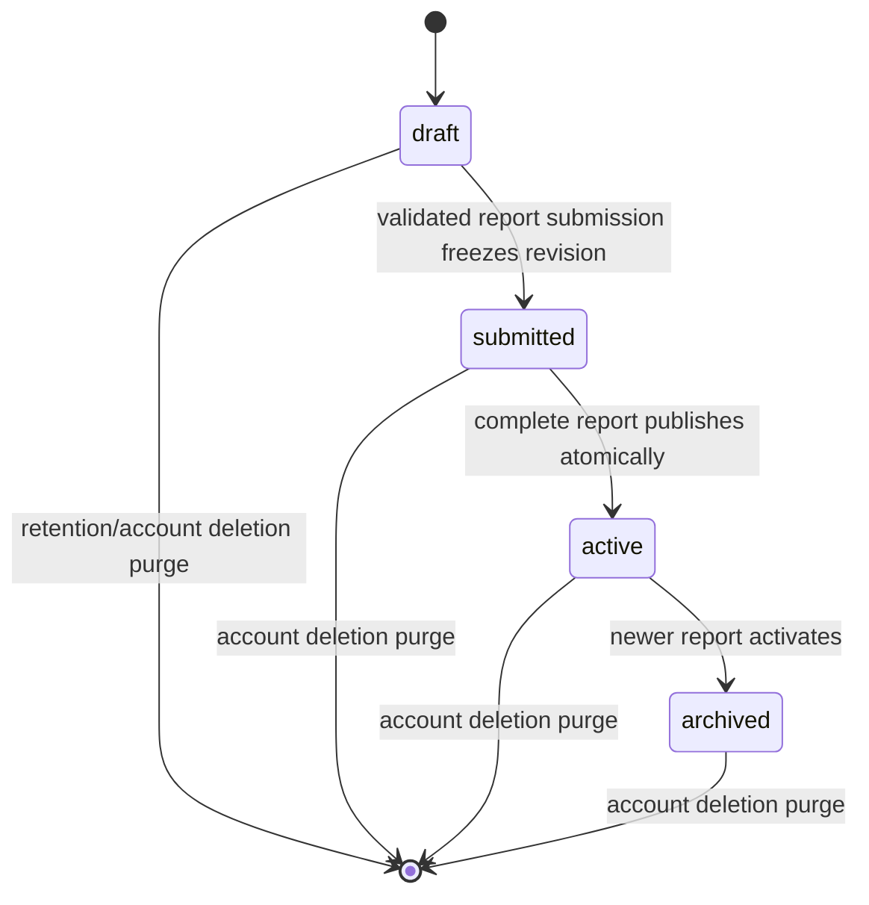
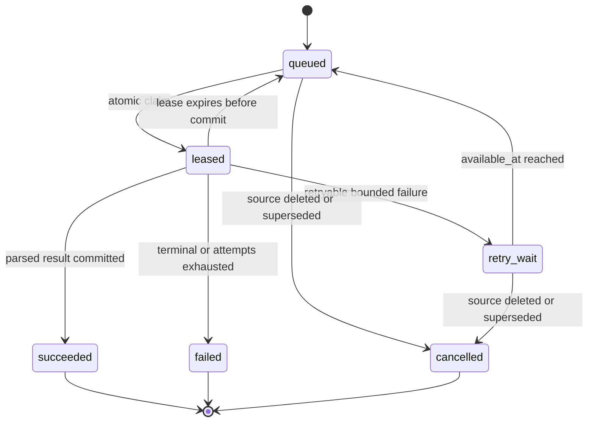
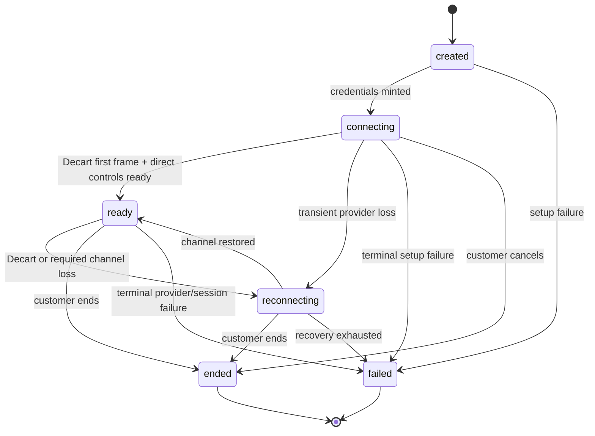

# Events and State Contract

- **Status:** Complete for application-contract review
- **Architecture:** direct synchronous operations plus Postgres-backed durable jobs; no event bus
- **State authority:** [data contract](data.md) for persisted enums and row transitions; this file for application commands, observable states, and transient realtime behavior

## Event model

Magic Mirror does not add an event-sourcing layer. A customer command either commits its named relational transaction or makes no durable change. Durable asynchronous work is represented by `private.processing_jobs`, and the customer polls the owning subject (`photos`, `report_runs`, or generated asset/report projection), not the private job row.

Only these durable notification/evidence records exist:

| Record | Trigger | Consumer | Idempotency |
|---|---|---|---|
| `processing_jobs` | accepted extraction, candidate, report, preview, notification, or retention work | one worker lease loop | globally unique `idempotency_key` |
| `notification_deliveries` | completed report + customer opted in | Resend worker path | one report/kind key |
| `outbound_events` | confirmed current retailer handoff | operational measurement | client/API request idempotency key |
| `consent_records` | customer grants/revokes a named purpose | authorization and retention logic | request idempotency; append-only event |
| `report_feedback` | customer submits report correction/feedback | later recalibration workflow | request idempotency |

No UI transcript, model response, voice transcript, media frame, gesture frame, product payload, or raw provider event is a durable event.

## Command semantics

- Every command has one authenticated owner, a request ID, and a bounded Zod input.
- Profile draft commands require `If-Match-Revision`; zero-row conditional update is `REVISION_CONFLICT`.
- Named create/action commands require `Idempotency-Key`. A replay with the same body returns the original result; same key with a different body returns `409 IDEMPOTENCY_KEY_REUSED`.
- A command that enqueues work commits the subject and job in the same transaction. The UI never shows processing when no durable subject/job exists.
- Cancel is effective only before a terminal commit and only where a data transition permits cancellation. Cancelling browser presentation alone does not falsely mark durable work cancelled.
- All state responses include the persisted `updatedAt` and, where applicable, profile `revision` or realtime `sequence`.

## Application state machines

### Profile and onboarding

Persisted profile status uses the data-contract values:



Within `draft`, `current_step` moves through `welcome → personal_details → brand_sizing → photos → photo_review → taste → account → profile_review → complete`. A customer may edit an earlier answer; the server recomputes the earliest incomplete step and invalidates only dependent draft evidence. Step progression never substitutes for completion validation.

The adopted conversation presentation has these transient states:

```text
idle -> sending -> assistant_streaming -> awaiting_answer
awaiting_answer -> clarifying -> awaiting_answer
awaiting_answer -> contextual_ui -> validating -> assistant_streaming
any nonterminal -> save_exit
network_error -> retry_same_turn | reload_from_profile_snapshot
```

Only an accepted `ConversationTurnResult` appears as a committed customer message. Optimistic bubbles are visually pending and are removed/retried on failure. Reload reconstructs facts and the next question, not a verbatim transcript.

### Photos and extraction

The exact persisted photo transitions are the data-contract matrix. The UI projection is:

| Persisted state | UI state | Allowed customer action |
|---|---|---|
| upload slot only | `uploading` | cancel local upload; retry immutable upload before slot expiry |
| `uploaded` | `validating` | wait |
| `accepted` | `ready_for_analysis` | remove before submission |
| `processing` | `extracting` | continue reviewing siblings |
| `complete` | `ready` | view safe summary; remove before submission |
| `partial` | `needs_attention` | retry extraction or continue with lower-confidence disclosure |
| `rejected` | `rejected` | remove and upload replacement |
| `failed` | `needs_attention` | retry if attempts remain or continue with fallback |
| expired/deleted | `unavailable` | upload a new photo |

One photo failure does not roll back siblings. `Continue` is enabled with 8–12 accepted, unexpired photos and the required consent; it does not wait for perfect extraction when the direct-signal fallback is available.

### Taste calibration

```text
candidate_loading -> ready -> reaction_pending -> reaction_committed -> next_candidate
candidate_loading -> fallback_ready
candidate_loading -> recoverable_error -> retry | fallback_ready
reaction_committed -> undo_pending -> ready_at_previous_candidate
```

The server counts only reactions with `undone_at=null`. Completion requires 12; the customer may continue to 20. Swipes and Love/Hate/Maybe buttons emit the same command. A mid-flow provider failure preserves committed reactions and supplies a balanced fallback without resetting progress.

### Account connection

```text
anonymous_ready -> transfer_preparing -> auth_redirect_or_email_sent
auth_redirect_or_email_sent -> auth_callback -> transfer_consuming -> connected
auth_callback -> transfer_conflict -> explicit_preserve_draft_confirmation -> connected
auth_redirect_or_email_sent -> expired_or_wrong_browser -> recovery
any_preconnected -> alternate_method
```

No UI state claims the draft is connected until transfer consumption commits. Authentication can succeed while draft transfer needs recovery; those results are shown separately.

### Durable processing job



A lease replay first checks the idempotency key and existing subject result. Worker progress never exposes private job payload/error. Long operations heartbeat only their lease.

### Report run and customer presentation

Persisted `report_runs` transition exactly as `queued → processing → succeeded|failed|cancelled`; retry creates a new sequence rather than reopening a terminal row. Stage is monotonic within a run:

```text
queued -> profile_analysis -> catalog_matching -> report_writing -> preview_generation -> finalizing
```

`preview_generation` may be skipped without failure when consent/rights/quality/provider gates do not pass. A report publishes only after required sections and base recommendations are valid.

| Condition | Screen state | Recovery |
|---|---|---|
| `queued` or processing <120s | analysis processing | poll every 2s; optional notification |
| processing >=120s | slow | keep polling, email when ready, leave safely |
| failed + retryable + sequence <3 | error recovery | create next run sequence |
| failed terminal/exhausted | error recovery | preserve inputs; support/recalibration path |
| succeeded | report overview | load immutable report |
| browser leaves | Style Home resume/recover | `resolveResume` returns active run |

Email failure never changes report success. Preview failure never changes recommendation/report success.

### Product and bag freshness

Stored references project to one of:

```text
refreshing -> available
refreshing -> unavailable -> alternatives | remove | close
refreshing -> provider_error -> retry_without_stale_handoff
```

The UI may keep Magic Mirror rationale while current facts are unavailable, but price, inventory, image, seller, or retailer link is never shown as current from stored data. A retailer handoff is `previewed → customer_confirmed → refreshed_token_consumed → external_navigation`; any material state change returns to preview.

### Live session

Persisted state uses `created`, `connecting`, `ready`, `reconnecting`, `ended`, and `failed`:



Voice and gestures are independent transient substates and do not replace persisted live status:

```text
voice: off -> requesting_permission -> connecting -> listening -> interpreting -> confirming? -> acting -> listening
voice failure -> reconnecting | off/direct_controls

gesture: off -> guide -> observing -> interpreting -> confirming? -> accepted -> observing
gesture low-confidence/failure -> ignored -> observing | off/direct_controls
```

Loss of Gemini leaves Decart and direct controls active. Loss of Decart may keep product selection/direct catalog actions but puts the visual session in reconnecting. Local gesture recognition pauses whenever camera input is unavailable.

## Shared live action contract

All direct controls, Gemini function calls, and local gesture proposals normalize into this exact object before any application action:

```json
{
  "actionId": "uuid",
  "sessionId": "uuid",
  "sequence": 12,
  "source": "direct | voice | gesture",
  "type": "next_item | previous_item | select_item | refine_results | add_to_bag | remove_from_bag | open_retailer | end_session | undo_last_selection",
  "arguments": {},
  "observedAt": "RFC3339 timestamp",
  "confidence": null
}
```

Rules:

- `sequence` is strictly greater than the last accepted sequence for the in-memory session dispatcher. Duplicate `actionId` or sequence is rejected.
- `confidence` is required and 0–1 for gestures, optional for voice, and null for direct actions.
- The session, item, bag item, and result-set references in arguments must be drawn from the server-provided current session snapshot. Arbitrary URLs/text commands are invalid.
- Gesture thresholds and the exact small vocabulary are set by the dual-realtime spike. Below-threshold input is ignored, never guessed.
- Gemini may call only these action names; manual tool responses report `accepted`, `confirmation_required`, or a safe rejection.

### Arguments

| Type | Exact arguments |
|---|---|
| `next_item`, `previous_item`, `end_session`, `undo_last_selection` | `{}` |
| `select_item` | catalog reference + optional recommendation ID |
| `refine_results` | `{ "query": string 1..300, "resultSetId": uuid }` |
| `add_to_bag` | catalog reference + source lineage |
| `remove_from_bag` | `{ "bagItemId": uuid }` |
| `open_retailer` | catalog reference |

### Confirmation policy

| Action | Direct | Voice | Gesture |
|---|---|---|---|
| next/previous/select/undo | execute when current | execute when unambiguous | execute only above spike threshold; show accepted/undo affordance |
| refine results | execute | confirm only if interpreted query is materially ambiguous | not in gesture vocabulary |
| add/remove bag | direct button is confirmation | always confirm | always confirm |
| open retailer | always retailer-boundary confirmation | always confirm | always confirm |
| end session | direct end button is confirmation | confirm | confirm |

Confirmation creates a signed opaque token containing action fingerprint, session, owner pseudonym, current sequence, relevant catalog state fingerprint, and a maximum 30-second expiry. It is not persisted. Editing a voice request creates a new proposal/token. Cancelling invalidates local use. The confirm endpoint rechecks session, ownership, current product, and action preconditions before committing.

### Undo

`Undo` after a non-consequential selection returns to the prior item if it remains in the current result set. It is local unless the prior selection was persisted to `live_sessions`, in which case the server applies the inverse selection with a new sequence. Bag removal uses its explicit operation; retailer navigation cannot be undone by Magic Mirror.

## Loading, slow, empty, and recovery standards

- Loading never removes the last valid customer state; it marks only the changing region busy.
- An empty state distinguishes `no customer data yet` from `provider unavailable` and `current product unavailable`.
- A slow state is time-based and does not imply failure.
- Retry reuses immutable inputs and creates only the allowed new attempt/sequence; it never duplicates a report, email, bag row, or event.
- Every failure exposes a direct recovery or safe exit. No awaited report/render/action fails silently.
- Screen reader announcements describe state and result, not internal provider/job names.
- Reduced-motion mode removes swipe/transition dependence; buttons and keyboard controls remain complete.
